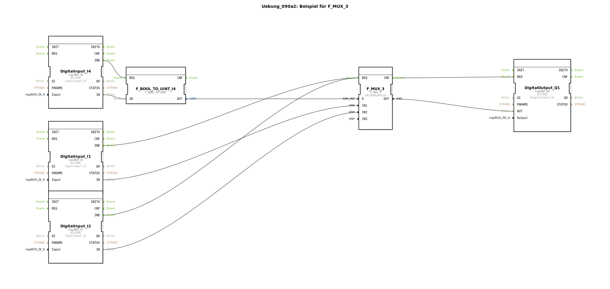

# Uebung_090a2: Beispiel für F_MUX_3

* * * * * * * * * *

## Einleitung
Diese Übung demonstriert die Verwendung des Multiplexer-Funktionsbausteins F_MUX_3 in Verbindung mit digitalen Ein- und Ausgängen. Die Übung zeigt, wie ein Multiplexer zur Steuerung von Ausgängen basierend auf verschiedenen Eingangssignalen eingesetzt werden kann.

**Hinweis**: Diese Übung enthält einen Kommentar, der darauf hinweist, dass sie derzeit nicht aufgespielt werden kann.

## Verwendete Funktionsbausteine (FBs)

### F_MUX_3
- **Typ**: Multiplexer mit 3 Eingängen
- **Parameter**: 
  - IN3 = BOOL#FALSE (fester Wert für dritten Eingang)

### DigitalInput_I1, DigitalInput_I2, DigitalInput_I4
- **Typ**: logiBUS_IX (digitale Eingänge)
- **Parameter**:
  - QI = TRUE (Qualified Input aktiviert)
  - Input = logiBUS_DI::Input_Ix (entsprechende Hardware-Eingänge)

### F_BOOL_TO_UINT_I4
- **Typ**: F_BOOL_TO_UINT (Boolescher zu Unsigned Integer Konverter)

### DigitalOutput_Q1
- **Typ**: logiBUS_QX (digitaler Ausgang)
- **Parameter**:
  - QI = TRUE (Qualified Output aktiviert)
  - Output = logiBUS_DO::Output_Q1 (Hardware-Ausgang Q1)

## Programmablauf und Verbindungen

### Ereignisverbindungen:
- DigitalInput_I4.IND → F_BOOL_TO_UINT_I4.REQ
- F_MUX_3.CNF → DigitalOutput_Q1.REQ
- DigitalInput_I1.IND → F_MUX_3.REQ
- DigitalInput_I2.IND → F_MUX_3.REQ

### Datenverbindungen:
- F_MUX_3.OUT → DigitalOutput_Q1.OUT
- DigitalInput_I1.IN → F_MUX_3.IN1
- DigitalInput_I2.IN → F_MUX_3.IN2
- DigitalInput_I4.IN → F_BOOL_TO_UINT_I4.IN
- F_BOOL_TO_UINT_I4.OUT → F_MUX_3.K

### Funktionsweise:
Der Multiplexer F_MUX_3 wählt basierend auf dem Steuersignal K (von F_BOOL_TO_UINT_I4) einen der drei Eingänge aus und gibt diesen am Ausgang OUT weiter. Die digitalen Eingänge I1 und I2 werden als wählbare Eingänge verwendet, während IN3 auf FALSE festgelegt ist. Der Eingang I4 dient als Steuersignal, das über den Konverter F_BOOL_TO_UINT in den Steuereingang K des Multiplexers umgewandelt wird.

## Zusammenfassung
Diese Übung veranschaulicht die grundlegende Verwendung eines Multiplexers in 4diac. Sie zeigt, wie verschiedene Eingangssignale über ein Steuersignal selektiv an einen Ausgang weitergeleitet werden können. Die Übung kombiniert digitale Ein-/Ausgänge mit Signalverarbeitungsbausteinen und Typkonvertierungen.