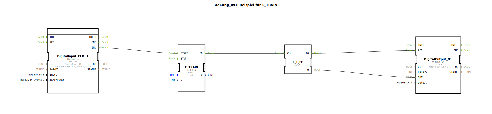

# Uebung_091: Beispiel für E_TRAIN

Dieser Artikel beschreibt die logiBUS®-Übung `Uebung_091`. Hier wird die automatische Erzeugung einer festen Anzahl von Ereignissen demonstriert.

## 🎧 Podcast

* [Als Landtechnik-Spezialist durch die Hölle: Wie Lanz-Wery Krieg, Besatzung und Hyperinflation überlebte – Einblicke in Original-Geschäftsberichte 1915-1922](https://podcasters.spotify.com/pod/show/ms-muc-lama/episodes/Als-Landtechnik-Spezialist-durch-die-Hlle-Wie-Lanz-Wery-Krieg--Besatzung-und-Hyperinflation-berlebte--Einblicke-in-Original-Geschftsberichte-1915-1922-e39athj)
* [Rudolf Diesel: Geniales Werk, mysteriöses Ende – Wer verschwand 1913 auf der Fähre?](https://podcasters.spotify.com/pod/show/ms-muc-lama/episodes/Rudolf-Diesel-Geniales-Werk--mysterises-Ende--Wer-verschwand-1913-auf-der-Fhre-e396oa6)
* [Smart Farming Vision 1991 Auernhammers Blaupausen](https://podcasters.spotify.com/pod/show/ms-muc-lama/episodes/Smart-Farming-Vision-1991-Auernhammers-Blaupausen-e3b09r2)

----

## Ziel der Übung

Verwendung des Bausteins `E_TRAIN`. Ziel ist es, nach einem einzelnen Start-Impuls eine definierte Folge von Ereignissen auszulösen.

-----

## Beschreibung und Komponenten

[cite_start]In `Uebung_091.SUB` wird ein Ereignis-Zug (Train) zur Steuerung eines Flip-Flops genutzt[cite: 1].

### Funktionsweise

1.  Der Nutzer klickt einmal auf Taster **I1**.
2.  Der Baustein `E_TRAIN` startet seine Arbeit.
3.  Laut Parameter `N=8` und `DT=1s` sendet der Baustein nun exakt **8 Ereignisse** im Abstand von jeweils einer Sekunde aus.
4.  Diese Ereignisse gelangen an das Toggle-Flip-Flop.
5.  Die Lampe an `Q1` blinkt daraufhin genau viermal (4 x An, 4 x Aus) und bleibt dann in der letzten Position stehen.

-----

## Anwendungsbeispiel

**Automatisches Abkippen**:
Ein Hydraulikzylinder soll zum Lockern von Material dreimal kurz ruckeln. Ein Tastendruck löst die Salve von 6 Steuerbefehlen (Ausfahren-Einfahren x 3) aus, woraufhin die Steuerung den Vorgang selbstständig beendet.