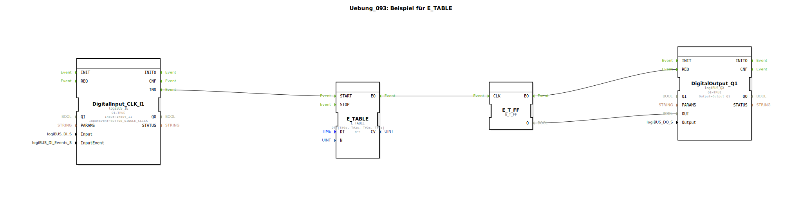

# Uebung_093: Beispiel für E_TABLE

Dieser Artikel beschreibt die logiBUS®-Übung `Uebung_093`. Hier wird ein komplexes Zeitmuster für Ereignisse definiert.

## 🎧 Podcast

* [Infineon CAN-Transceiver TLE9250V versus TLE9351VSJ](https://podcasters.spotify.com/pod/show/ms-muc-lama/episodes/Infineon-CAN-Transceiver-TLE9250V-versus-TLE9351VSJ-e3b8nan)
* [Infineon TLE9351VSJ der unsichtbare Auto-Bodyguard](https://podcasters.spotify.com/pod/show/ms-muc-lama/episodes/Infineon-TLE9351VSJ-der-unsichtbare-Auto-Bodyguard-e3b8nhl)

----

## Ziel der Übung

Verwendung des Bausteins `E_TABLE`. Im Gegensatz zum gleichmäßigen Takt des `E_TRAIN` erlaubt dieser Baustein die Definition von individuellen Verzögerungszeiten für jedes Ereignis in einer Liste (Array).

-----

## Beschreibung und Komponenten

[cite_start]In `Uebung_093.SUB` ist ein Zeit-Array hinterlegt: `[T#0s, T#2s, T#3s, T#4s]`[cite: 1].

### Funktionsweise

Ein Klick auf **I1** startet die Tabelle:
1.  Ereignis 1: Sofort (`0s`).
2.  Ereignis 2: Nach weiteren 2 Sekunden.
3.  Ereignis 3: Nach weiteren 3 Sekunden.
4.  Ereignis 4: Nach weiteren 4 Sekunden.

Das angeschlossene Flip-Flop erzeugt somit ein unregelmäßiges Blinkmuster am Ausgang `Q1`, das exakt dem vorgegebenen Zeitplan entspricht. Dies ermöglicht die Programmierung von spezifischen Start-Sequenzen oder rhythmischen Abläufen.