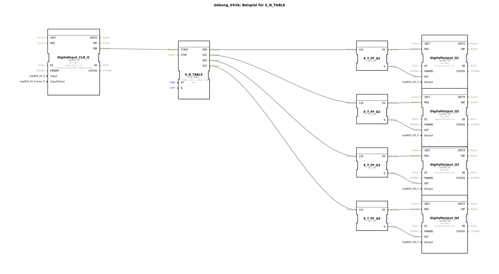

# Uebung_093b: Beispiel für E_N_TABLE

Dieser Artikel beschreibt die logiBUS®-Übung `Uebung_093b`.

----

## Übersicht

[cite_start]Erweiterung des Tabellen-Konzepts unter Verwendung des Bausteins `E_N_TABLE`[cite: 1].
Anstatt alle Ereignisse an einen gemeinsamen Ausgang zu senden, verfügt dieser Baustein über separate Ausgänge (`EO0` bis `EOn`) für jeden Tabelleneintrag.
In dieser Übung werden dadurch vier verschiedene Lampen (`Q1` bis `Q4`) in einer zeitlich exakt definierten, unregelmäßigen Abfolge nacheinander eingeschaltet. Dies ist die effizienteste Methode, um komplexe Start-Up-Sequenzen für Multi-Aktor-Systeme zu definieren.

