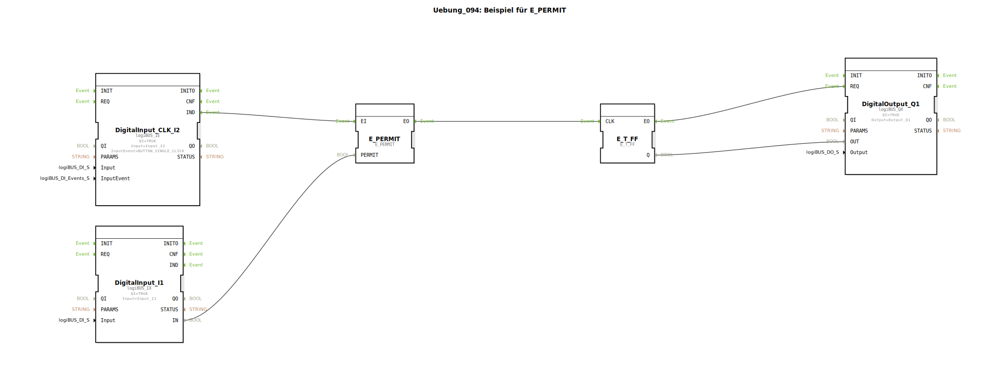

# Uebung_094: Beispiel für E_PERMIT

Dieser Artikel beschreibt die logiBUS®-Übung `Uebung_094`. Hier wird eine Schutzfunktion für Ereignisströme implementiert.

## 🎧 Podcast

* [Verfassungskunst 1946: Bayerns Bildungsauftrag zwischen Heimatliebe, Demokratie und Völkerversöhnung](https://podcasters.spotify.com/pod/show/ms-muc-lama/episodes/Verfassungskunst-1946-Bayerns-Bildungsauftrag-zwischen-Heimatliebe--Demokratie-und-Vlkervershnung-e38dj0l)

----

## Ziel der Übung

Verwendung des Bausteins `E_PERMIT`. Ziel ist es, die Ausführung einer Aktion (Ereignis) von einer Bedingung (Datenwert) abhängig zu machen.

-----

## Funktionsweise

[cite_start]Die Subapplikation `Uebung_094.SUB` nutzt einen Schalter als Freigabe für einen Taster[cite: 1].
*   Taster **I2** liefert den Auslöse-Impuls.
*   Schalter **I1** liefert die Freigabe (`PERMIT`).
*   Nur wenn **I1** auf `TRUE` steht, leitet der Baustein den Klick von **I2** an das Flip-Flop weiter. Ist der Schalter aus, verpufft das Ereignis wirkungslos.

Dies ist eine einfache, aber effektive Methode zur Realisierung von Verriegelungen.