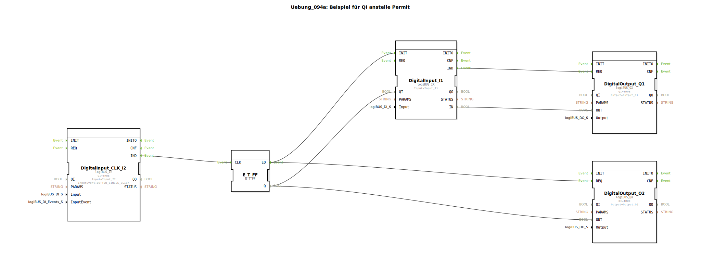

# Uebung_094a: Beispiel für QI anstelle Permit

Dieser Artikel beschreibt die logiBUS®-Übung `Uebung_094a`. Hier wird eine alternative Methode zur Freigabe-Steuerung gezeigt, die direkt in den Bausteinen eingebaut ist.

----

## Übersicht

[cite_start]Anstatt einen externen `E_PERMIT` Baustein zu nutzen, wird hier der Standard-Port `QI` (Qualified Input) des Eingangsbausteins `DigitalInput_I1` verwendet[cite: 1].
Über ein Toggle-Flip-Flop wird der `QI` Eingang ein- und ausgeschaltet. Steht `QI` auf `FALSE`, ist der gesamte Baustein deaktiviert und sendet keine Ereignisse mehr an den Ausgang `Q1`, selbst wenn sich der physikalische Zustand am Hardware-Pin ändert. Dies ist die sauberste Methode, um ganze Funktionsblöcke im Programm schlafen zu legen.

