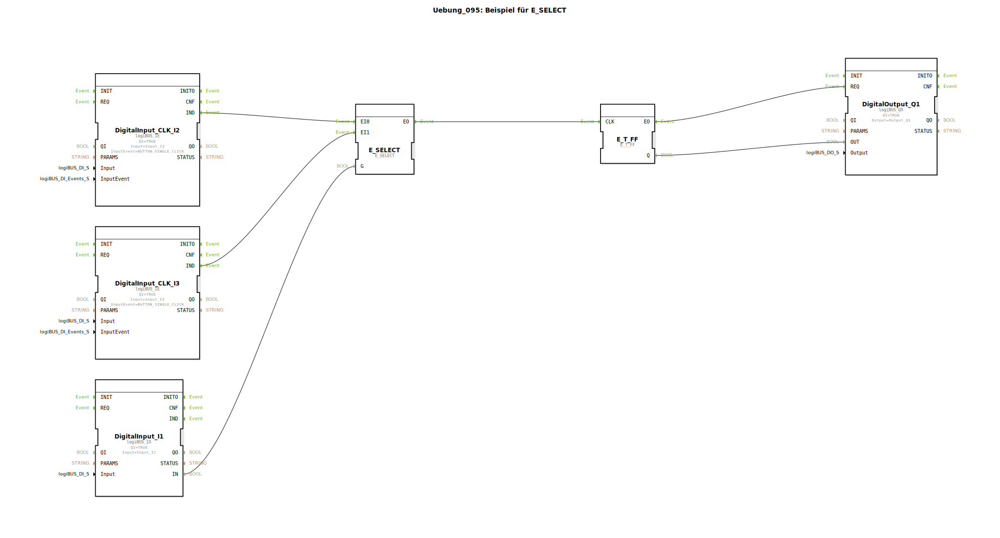

# Uebung_095: Beispiel für E_SELECT

Dieser Artikel beschreibt die logiBUS®-Übung `Uebung_095`. Hier wird die Auswahl zwischen zwei verschiedenen Ereignisquellen demonstriert.

----

## Ziel der Übung

Verwendung des Bausteins `E_SELECT`. Dieser fungiert als Weiche für eintreffende Ereignisse ("Gegenstück" zum `E_SWITCH`).

-----

## Funktionsweise

[cite_start]In `Uebung_095.SUB` bestimmen zwei Taster und ein Wahlschalter die Logik[cite: 1].

*   Schalter **I1** dient als Selektor (`G`).
*   Ist **I1** auf `FALSE`, wird nur das Ereignis von Taster **I2** (`EI0`) zum Ausgang durchgelassen.
*   Ist **I1** auf `TRUE`, wird nur das Ereignis von Taster **I3** (`EI1`) zum Ausgang durchgelassen.

Dies ermöglicht es, eine gemeinsame Funktion (hier das Umschalten von `Q1`) wahlweise von verschiedenen Quellen auslösen zu lassen, wobei die Steuerung aktiv festlegt, welche Quelle gerade "hörbereitschaft" hat.