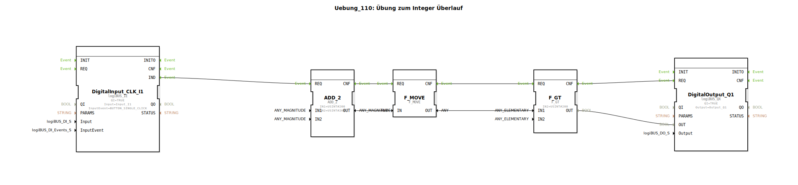

# Uebung_110: Übung zum Integer Überlauf

Dieser Artikel beschreibt die logiBUS®-Übung `Uebung_110`. Hier wird ein wichtiges Phänomen der digitalen Datenverarbeitung demonstriert: Der Überlauf von Variablen.

----

## Ziel der Übung

Verständnis der Begrenzung von Datentypen. Es wird gezeigt, was passiert, wenn das Ergebnis einer Berechnung den maximalen Wertebereich eines Datentyps überschreitet.

-----

## Beschreibung und Komponenten

[cite_start]Die Subapplikation `Uebung_110.SUB` nutzt den Datentyp `USINT` (Unsigned Short Integer)[cite: 1]. Dieser hat einen Wertebereich von 0 bis 255.

### Funktionsbausteine (FBs)

  * **`ADD_2`**: Addiert zwei Werte.
  * **Parameter**: `IN1 = 200`, `IN2 = 200`.
  * **`F_GT`**: Prüft, ob das Ergebnis größer als 200 ist.

-----

## Das Experiment

1.  Mathematisch ergibt `200 + 200 = 400`.
2.  Da die Variable vom Typ `USINT` aber nur bis **255** zählen kann, tritt ein Überlauf (Wrap-around) auf.
3.  Das Ergebnis in der Steuerung ist `400 - 256 = 144`.
4.  Der Vergleich `144 > 200` schlägt fehl (liefert `FALSE`).
5.  Die Lampe an `Q1` bleibt aus, obwohl man rein rechnerisch ein "Wahr" erwarten würde.

-----

## Fazit

Diese Übung mahnt zur Vorsicht bei der Wahl der Datentypen. Für Werte, die 255 überschreiten können, muss zwingend ein größerer Typ (z.B. `UINT` bis 65.535 oder `UDINT`) verwendet werden, um logische Fehler in der Steuerung zu vermeiden.