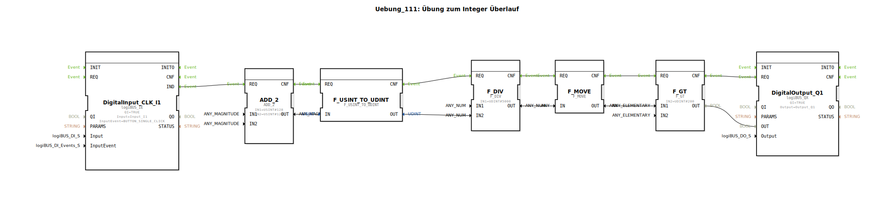

# Uebung_111: Übung zum Integer Überlauf

Dieser Artikel beschreibt die logiBUS®-Übung `Uebung_111`. Hier wird gezeigt, wie man durch rechtzeitige Konvertierung in größere Datentypen Rechenfehler verhindert.

----

## Übersicht

[cite_start]In `Uebung_111.SUB` wird das Überlauf-Problem aus Übung 110 gelöst[cite: 1].
Bevor die kritische Berechnung oder der Vergleich stattfindet, wird der kleine Datentyp `USINT` über den Baustein `F_USINT_TO_UDINT` in einen großen 32-Bit-Typ gewandelt. Dadurch steht genügend "Platz" für das Ergebnis zur Verfügung, und der anschließende Vergleich liefert das mathematisch korrekte Ergebnis. Dies demonstriert den sauberen Umgang mit verschiedenen numerischen Genauigkeiten im Programmablauf.

