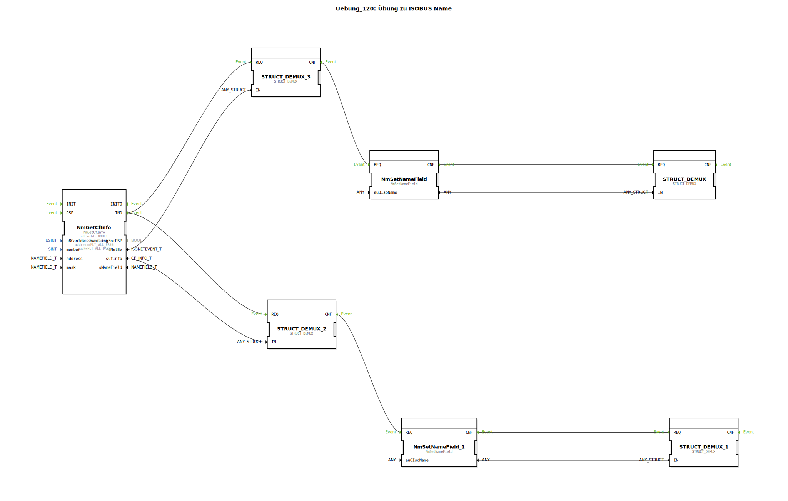

# Uebung_120: Übung zu ISOBUS Name

Dieser Artikel beschreibt die logiBUS®-Übung `Uebung_120`. Hier wird gezeigt, wie man die Identität von Geräten im ISOBUS-Netzwerk ermittelt.

----

## Ziel der Übung

Verwendung des Bausteins `NmGetCfInfo`. Jedes ISOBUS-Gerät besitzt einen weltweit eindeutigen 64-Bit Namen (NAME). Ziel ist es, diese Namen von anderen Teilnehmern am Bus einzulesen und in ihre Bestandteile zu zerlegen.

-----

## Beschreibung und Komponenten

[cite_start]In `Uebung_120.SUB` wird das Netzwerk nach aktiven Control Functions (CF) durchsucht[cite: 1].

### Funktionsbausteine (FBs)

  * **`NmGetCfInfo`**: Scant den Bus nach Teilnehmern.
  * **`NmSetNameField`**: Zerlegt den 64-Bit Rohwert in die standardisierten ISOBUS-Felder.
  * **`STRUCT_DEMUX`**: Macht die einzelnen Felder (Hersteller-Code, Geräteserie, Instanz etc.) für die Programmlogik zugänglich.

-----

## Funktionsweise

Der Baustein `NmGetCfInfo` liefert bei jedem Scan-Vorgang ein Datenpaket (`sCfInfo`), das den Namen eines Teilnehmers enthält. Über die nachgeschalteten Analyse-Bausteine kann das Programm nun genau "lesen", welche Geräte (z.B. ein Terminal der Firma X oder ein Joystick der Firma Y) gerade am Traktor angeschlossen sind. Dies ist die Voraussetzung für automatisches Plug-and-Play.