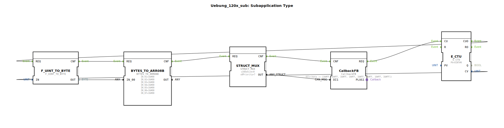

# Uebung_120x_sub: Subapplication Type

* * * * * * * * * *

## Einleitung

Diese SubApp demonstriert die Erzeugung einer ISOBUS CAN-Nachricht mit einem inkrementierenden Zählerwert. Der zentrale Ablauf wandelt einen Zählerstand in ein Byte um, erstellt daraus ein Byte‑Array, multiplex dieses in eine CAN‑MSG‑Struktur und übergibt die Nachricht über einen Callback‑Baustein an den ISOBUS-Kommunikationsadapter. Die Übung vermittelt Grundlagen der Datenkonvertierung, der Nutzung von Struktur‑Multiplexern und der Ereignissteuerung in 4diac‑IDE.

## Verwendete Funktionsbausteine (FBs)

### Funktionsbausteine

- **E_CTU** (`iec61499::events::E_CTU`)
    - Parameter: `PV = UINT#0`
    - Ereigniseingang: `CU` (Zählimpuls)
    - Ereignisausgang: `CUO` (Überlauf, sofort bei jedem Impuls da PV=0)
    - Datenausgang: `CV` (aktueller Zählerstand, UINT)

- **F_UINT_TO_BYTE** (`iec61131::conversion::F_UINT_TO_BYTE`)
    - Parameter: Keine
    - Ereigniseingang: `REQ` (Auslösung)
    - Ereignisausgang: `CNF` (Bestätigung)
    - Dateneingang: `IN` (UINT)
    - Datenausgang: `OUT` (BYTE)

- **BYTES_TO_ARR08B** (`logiBUS::utils::conversion::arr::reversing::BYTES_TO_ARR08B`)
    - Parameter: `IN_01` … `IN_07` = `16#00` (vordefinierte Bytes)
    - Ereigniseingang: `REQ` (Auslösung)
    - Ereignisausgang: `CNF` (Bestätigung)
    - Dateneingang: `IN_00` (BYTE)
    - Datenausgang: `OUT` (ARRAY[0..7] OF BYTE)

- **STRUCT_MUX** (`eclipse4diac::convert::STRUCT_MUX`)
    - Attribut: `StructuredType` = `isobus::pgn::CAN_MSG`
    - Parameter: `u16DaSize` = `0`, `u8Priority` = `7`
    - Ereigniseingang: `REQ` (Auslösung)
    - Ereignisausgang: `CNF` (Bestätigung)
    - Dateneingang: `data` (ARRAY[0..7] OF BYTE)
    - Datenausgang: `OUT` (Struktur `CAN_MSG`)

- **CallbackFB** (`isobus::pgn::tx::CallbackFB`)
    - Parameter: `DI1 = (data := [16#FF, 16#FF, 16#FF, 16#FF, 16#FF, 16#FF, 16#FF, 16#FF])`
    - Ereigniseingang: `CNF` (Bestätigung)
    - Ereignisausgang: `REQ` (Anforderung)
    - Dateneingang: `DI1` (Struktur `CAN_MSG`)

## Programmablauf und Verbindungen

Die SubApp arbeitet ereignisgesteuert. Der Ablauf startet, sobald der Baustein **CallbackFB** ein externes Ereignis erhält (nicht im SubApp‑Netzwerk dargestellt) und seinen `REQ`‑Ausgang auslöst. Dieses Ereignis triggert den Zähler **E_CTU** (über den Eingang `CU`). Da der Parameter `PV` auf `0` gesetzt ist, wird sofort der Überlauf (`CUO`) aktiviert.

1. **Zählerstand in Byte umwandeln**:  
   Der Überlauf (`E_CTU.CUO`) triggert den Baustein `F_UINT_TO_BYTE`. Der aktuelle Zählerstand (`E_CTU.CV`) wird an den Dateneingang `IN` übergeben. Der Baustein konvertiert den UINT‑Wert in ein einzelnes Byte (`OUT`).

2. **Byte‑Array aufbauen**:  
   Das konvertierte Byte (`F_UINT_TO_BYTE.OUT`) wird an den Dateneingang `IN_00` des Bausteins **BYTES_TO_ARR08B** weitergeleitet. Die übrigen Eingänge (`IN_01` … `IN_07`) sind fest mit `16#00` belegt. Bei der Auslösung (`BYTES_TO_ARR08B.REQ`) wird ein Array von 8 Bytes erzeugt, wobei die Reihenfolge ggf. umgekehrt wird („reversing“). Das vollständige Array steht am Ausgang `OUT` zur Verfügung.

3. **Nachrichtenstruktur multiplexen**:  
   Der Baustein **STRUCT_MUX** empfängt das Byte‑Array über seinen Dateneingang `data`. Bei jedem Aufruf (`STRUCT_MUX.REQ`) erzeugt er eine Struktur vom Typ `CAN_MSG` mit den vorgegebenen Parametern (`u16DaSize=0`, `u8Priority=7`). Die fertige Nachricht wird am Ausgang `OUT` bereitgestellt.

4. **Nachricht senden**:  
   Die erzeugte `CAN_MSG`‑Struktur wird in den Dateneingang `DI1` des **CallbackFB** geschrieben. Die Bestätigung des Multiplex (`STRUCT_MUX.CNF`) triggert den Bestätigungseingang `CallbackFB.CNF`. Der CallbackFB kann nun die Nachricht über den Adapter `PLUG1` an die ISOBUS‑Schnittstelle weiterleiten.

**Datenflüsse** (vereinfacht):
- `E_CTU.CV` → `F_UINT_TO_BYTE.IN`
- `F_UINT_TO_BYTE.OUT` → `BYTES_TO_ARR08B.IN_00`
- `BYTES_TO_ARR08B.OUT` → `STRUCT_MUX.data`
- `STRUCT_MUX.OUT` → `CallbackFB.DI1`

**Ereignisflüsse**:
- `CallbackFB.REQ` → `E_CTU.CU`
- `E_CTU.CUO` → `F_UINT_TO_BYTE.REQ`
- `F_UINT_TO_BYTE.CNF` → `BYTES_TO_ARR08B.REQ`
- `BYTES_TO_ARR08B.CNF` → `STRUCT_MUX.REQ`
- `STRUCT_MUX.CNF` → `CallbackFB.CNF`

## Zusammenfassung

Die Übung **Uebung_120x_sub** zeigt, wie aus einem einfachen Zählerwert eine vollständige ISOBUS‑CAN‑Nachricht aufgebaut und über einen standardisierten Adapter versendet werden kann. Sie vermittelt wichtige Konzepte der IEC 61499 wie ereignisgesteuerte Verarbeitungsketten, Datentypkonvertierung (UINT → BYTE → Array → Struktur) und die Nutzung von Adapter‑Schnittstellen für buskommunikative Funktionsbausteine. Die SubApp kann als Grundlage für eigene CAN‑Nachrichten‑Generatoren verwendet werden und erleichtert das Verständnis der ISOBUS‑PGN‑Übertragung mit 4diac.