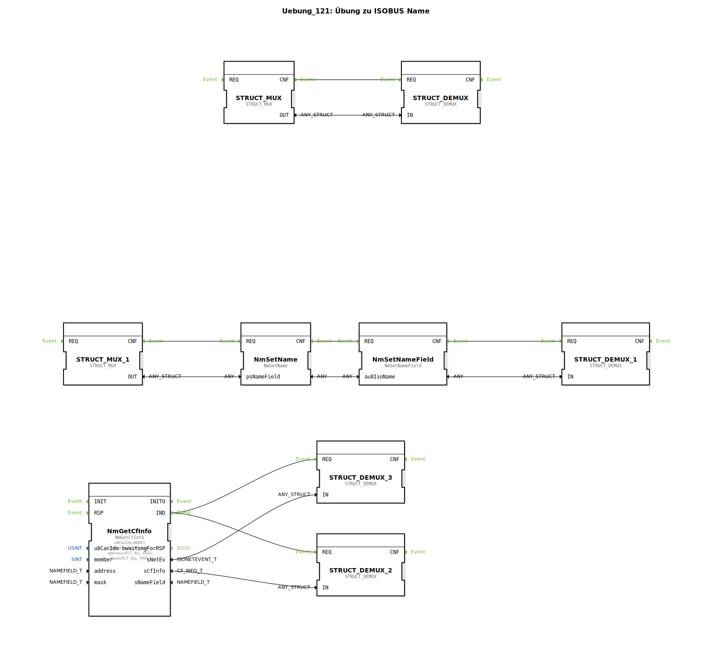

# Uebung_121: Übung zu ISOBUS Name

Dieser Artikel beschreibt die logiBUS®-Übung `Uebung_121`.

----

## Übersicht

[cite_start]In dieser Übung wird das Gegenstück zu 120 gezeigt: Das Auslesen der eigenen Identität[cite: 1].
Über den Parameter `member = thisMember` am Baustein `NmGetCfInfo` liefert die Steuerung ihren eigenen 64-Bit Namen zurück. Mit dem Baustein `NmSetName` können zudem die einzelnen Felder der eigenen Identität (z.B. die Funktions-Instanz) zur Laufzeit dynamisch angepasst werden, bevor sie über den Bus kommuniziert werden.

