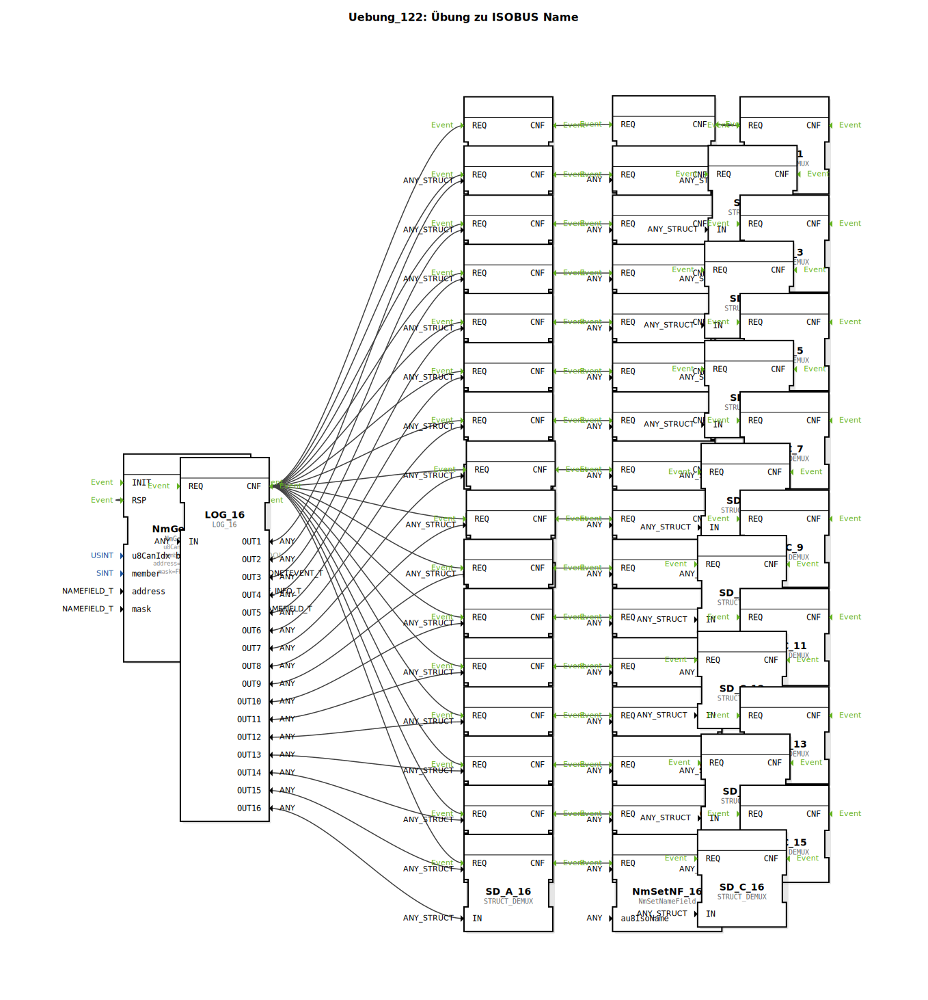

# Uebung_122: Übung zu ISOBUS Name

Dieser Artikel beschreibt die logiBUS®-Übung `Uebung_122`.

----

## Übersicht

[cite_start]Diese Übung demonstriert die Erfassung einer größeren Anzahl von Bus-Teilnehmern[cite: 1].
Unter Verwendung des Bausteins `LOG_16` werden die Namen von bis zu 16 verschiedenen Control Functions im Netzwerk gleichzeitig gepuffert und analysiert. Für jeden Teilnehmer wird über eine Kette von `NmSetNameField` Bausteinen eine detaillierte Analyse der Identität durchgeführt. Dies ist ein Werkzeug für komplexe Diagnosesysteme, die den gesamten Geräteverbund eines Gespanns überwachen müssen.

