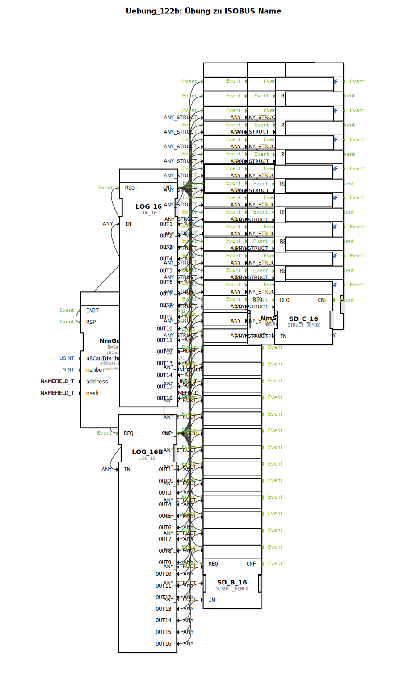

Hier ist die Dokumentationsseite für die Übung **Uebung_122b** basierend auf den bereitgestellten XML-Daten.

# Uebung_122b: Übung zu ISOBUS Name

* * * * * * * * * *

## Einleitung
Diese Übung („Übung zu ISOBUS Name“) beschäftigt sich mit der Analyse und Aufschlüsselung des **ISOBUS NAME**-Feldes gemäß ISO 11783. Ziel ist es, Informationen über Teilnehmer (Control Functions - CF) am Bus abzurufen, deren 64-Bit-Namen zu extrahieren und diesen Namen in seine einzelnen Bestandteile (wie Hersteller, Geräteklasse, Funktion usw.) zu zerlegen.

Die Übung ist als Sub-Application (`SubAppType`) realisiert und verarbeitet Listen von Netzwertereignissen und CF-Informationen.

## Verwendete Funktionsbausteine (FBs)

In dieser Sub-Application werden verschiedene Funktionsbausteine instanziiert, um die Datenverarbeitung und -visualisierung zu realisieren.

### Haupt-Bausteine:

#### 1. NmGetCfInfo (`isobus::pgn::NmGetCfInfo`)
Dieser Baustein ist der Einstiegspunkt der Übung. Er ruft Informationen über die Control Functions (CF) im Netzwerk ab.
- **Parameter**:
    - `u8CanIdx` = `NODE1` (CAN-Knoten 1)
    - `member` = `intern`
    - `address` = `FLT_ALL_PASS` (Filter: Alle Adressen)
    - `mask` = `FLT_ALL_PASS`
- **Funktionsweise**: Er liefert Arrays von Netzwerkereignissen (`sNetEv`) und CF-Informationen (`sCfInfo`), die anschließend verarbeitet werden.

#### 2. LOG_16 (`logiBUS::utils::logging::LOG_16`)
Hier werden zwei Instanzen (`LOG_16` und `LOG_16B`) verwendet.
- **Funktionsweise**: Diese Bausteine dienen in dieser Übung als "Splitter" oder De-Multiplexer für Arrays. Sie nehmen die Listen (Arrays mit bis zu 16 Einträgen) von `NmGetCfInfo` entgegen und geben die einzelnen Elemente an 16 separaten Ausgängen aus. Dies ermöglicht die parallele Verarbeitung der ersten 16 erkannten Geräte.

#### 3. STRUCT_DEMUX (`eclipse4diac::convert::STRUCT_DEMUX`)
Dieser generische Konvertierungsbaustein wird vielfach eingesetzt (`SD_A_x`, `SD_B_x`, `SD_C_x`), um komplexe Datentypen (Strukturen) in ihre Einzelteile zu zerlegen, damit diese visualisiert oder weiterverarbeitet werden können.
- **Verwendete Typen**:
    - `isobus::pgn::ISONETEVENT_T` (bei `SD_A_x`): Extrahiert u.a. den rohen `cfName`.
    - `isobus::pgn::CF_INFO_T` (bei `SD_B_x`): Zeigt Statusinformationen der CF an.
    - `isobus::pgn::NAMEFIELD_T` (bei `SD_C_x`): Zeigt die dekodierten Felder des ISOBUS Namens an.

#### 4. NmSetNameField (`isobus::pgn::NmSetNameField`)
Dies ist der Kernbaustein für die Interpretation des Namens. Er kommt 16-mal vor (`NmSetNF_1` bis `NmSetNF_16`).
- **Eingang**: `au8IsoName` (Der 64-Bit ISOBUS Name als Byte-Array).
- **Funktionsweise**: Der Baustein analysiert den ISOBUS-Namen und schlüsselt ihn gemäß der Norm in eine Struktur (`NAMEFIELD_T`) auf. Diese enthält Informationen wie:
    - Identity Number
    - Manufacturer Code
    - ECU Instance
    - Function Instance
    - Function
    - Vehicle System
    - Industry Group
    - Arbitrary Address Capable

## Programmablauf und Verbindungen

Der Ablauf der Übung lässt sich in drei parallele Verarbeitungsstränge unterteilen, die durch das Triggern von `NmGetCfInfo` angestoßen werden:

1.  **Erfassung (NmGetCfInfo)**:
    Der Baustein scannt den Bus und gibt bei Ereignissen (`IND`) die aktuellen Listen der Netzwerkteilnehmer aus.

2.  **Verteilung (LOG_16 & LOG_16B)**:
    Die Ausgänge `sNetEv` (Network Events) und `sCfInfo` (Control Function Infos) werden an die `LOG_16`-Bausteine übergeben. Diese brechen die Arrays auf einzelne Verbindungen herunter (Index 1 bis 16).

3.  **Verarbeitungspfad A & C (Namens-Analyse)**:
    - Die einzelnen Netzwerkereignisse gehen vom `LOG_16` zu den `SD_A`-Bausteinen.
    - Dort wird das Attribut `cfName` (der ISOBUS Name) extrahiert.
    - Dieser `cfName` wird direkt an den jeweiligen `NmSetNF`-Baustein weitergeleitet.
    - Der `NmSetNF`-Baustein dekodiert den Namen.
    - Das Ergebnis (die Struktur mit den lesbaren Feldern) wird im `SD_C`-Baustein aufgeschlüsselt angezeigt. So kann man z.B. sehen, welcher Hersteller hinter einem Gerät steckt.

4.  **Verarbeitungspfad B (Info-Anzeige)**:
    - Parallel dazu werden die allgemeinen CF-Informationen vom `LOG_16B` an die `SD_B`-Bausteine geleitet. Dies dient vermutlich der Diagnose von Adressen und Status der Teilnehmer, unabhängig von der Namens-Dekodierung.

## Zusammenfassung

Die Übung **Uebung_122b** demonstriert die Detailanalyse von ISOBUS-Teilnehmern. Durch die Kombination von Listenabruf, De-Multiplexing und spezifischen Parsing-Bausteinen (`NmSetNameField`) wird gezeigt, wie aus dem kryptischen 64-Bit-Namen eines Steuergerätes (ECU) menschenlesbare Informationen wie Hersteller, Geräteklasse und Funktion extrahiert werden können. Dies ist essenziell für Diagnoseanwendungen und die Interoperabilität im ISOBUS-Netzwerk.