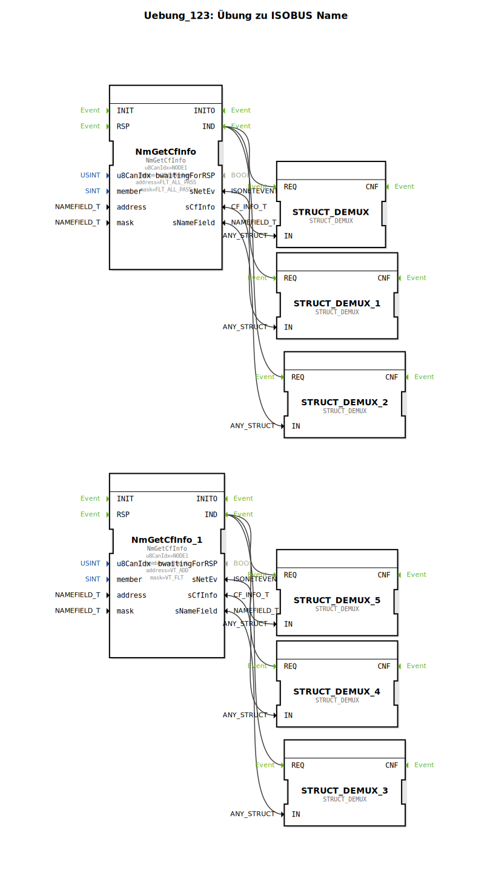

# Uebung_123: Übung zu ISOBUS Name

Dieser Artikel beschreibt die logiBUS®-Übung `Uebung_123`.

----

## Übersicht

[cite_start]Hier wird gezeigt, wie man den Netzwerk-Scan gezielt auf bestimmte Gerätetypen einschränkt[cite: 1].
Durch die Angabe einer Zieladresse (`VT_ADD`) und einer Maske (`VT_FLT`) am Baustein `NmGetCfInfo_1` wird das Programm so konfiguriert, dass es nur auf Teilnehmer reagiert, die dem Profil eines "Virtual Terminals" (VT) entsprechen. Alle anderen Bus-Teilnehmer (z.B. Joysticks oder Task Controller) werden von diesem Baustein ignoriert. Dies ermöglicht eine saubere Trennung der Kommunikationslogik nach Funktionsgruppen.

