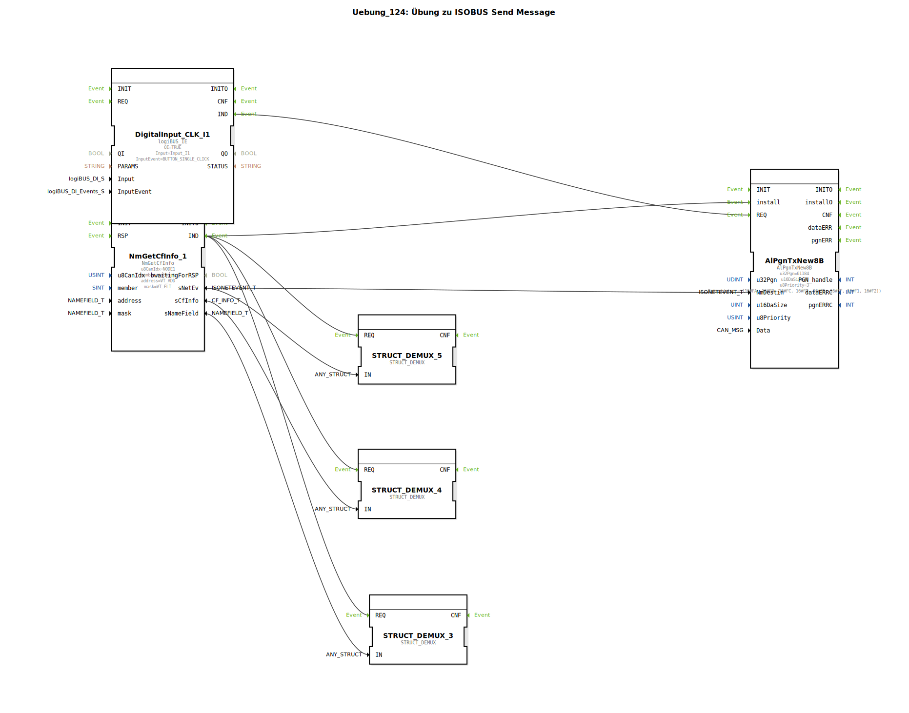

# Uebung_124: Übung zu ISOBUS Send Message

Dieser Artikel beschreibt die logiBUS®-Übung `Uebung_124`. Hier verlassen wir die Standard-Nachrichten und senden eigene Datenpakete (PGNs) an einen spezifischen Partner im Netzwerk.

----

## Ziel der Übung

Verwendung des Bausteins `AlPgnTxNew8B`. Es wird gezeigt, wie man eine herstellerspezifische Nachricht (Proprietary PGN) definiert und diese gezielt an ein anderes Steuergerät sendet.

-----

## Beschreibung und Komponenten

[cite_start]Die Subapplikation `Uebung_124.SUB` kombiniert die Teilnehmer-Suche mit einem Sende-Baustein[cite: 1].

### Funktionsbausteine (FBs)

  * **`NmGetCfInfo_1`**: Sucht den Zielpartner (hier ein Virtual Terminal).
  * **`AlPgnTxNew8B`**: Der Sende-Baustein für 8-Byte Nachrichten.
  * **Parameter**:
    * `u32Pgn`: Die Nummer der Nachricht (hier `61184` = Proprietary A).
    * `Data`: Der Inhalt der Nachricht (8 Bytes Hex-Daten).

-----

## Funktionsweise

1.  Zuerst identifiziert `NmGetCfInfo` den Partner und liefert dessen Netzwerk-Identität (`NmDestin`).
2.  Durch das `IND`-Event wird der Sende-Baustein einmalig im System registriert (`install`).
3.  Jeder Klick auf den physischen Taster **I1** triggert nun den `REQ`-Eingang.
4.  Die Steuerung sendet daraufhin das vordefinierte Datenpaket direkt an den gewählten Partner.

Dies ist die Grundlage für die herstellerspezifische Kommunikation zwischen Traktor und Anbaugerät.