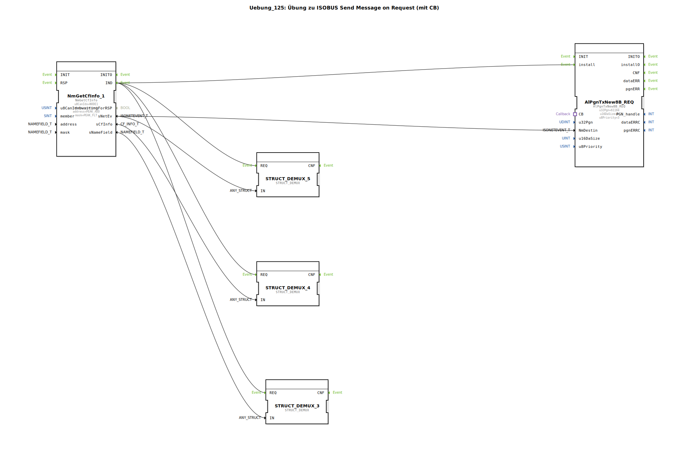

# Uebung_125: Übung zu ISOBUS Send Message on Request (mit CB)

Dieser Artikel beschreibt die logiBUS®-Übung `Uebung_125`.

----

## Übersicht

[cite_start]Verwendung des Bausteins `AlPgnTxNew8B_REQ` mit Callback-Funktion[cite: 1].
In dieser Übung sendet die Steuerung die Daten nicht von sich aus, sondern wartet passiv auf eine Anfrage (ISO Request) eines anderen Teilnehmers. Sobald eine Anfrage für die spezifizierte PGN (`61184`) eintrifft, holt sich der Baustein die aktuellen Daten über den Adapter-Port `CB` (Callback) aus der Sub-Applikation `DataSupply` und sendet die Antwort automatisch zurück. Dies spart Buslast, da Daten nur bei echtem Bedarf übertragen werden.

