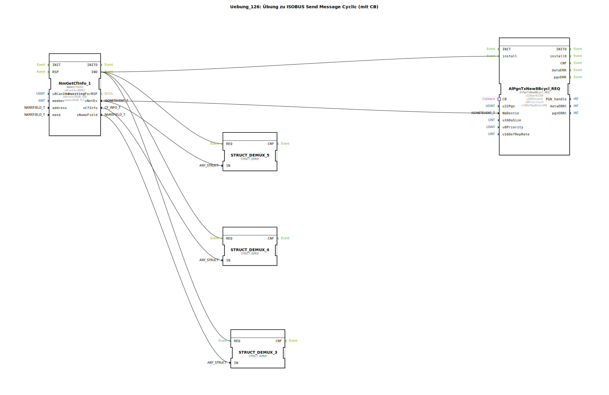

# Uebung_126: Übung zu ISOBUS Send Message Cyclic (mit CB)

Dieser Artikel beschreibt die logiBUS®-Übung `Uebung_126`.

----

## Übersicht

[cite_start]Verwendung des Bausteins `AlPgnTxNew8Bcycl_REQ`[cite: 1].
Hier wird die Nachricht in einem festen Zeitintervall (Parameter `u16DefRepRate = 500`ms) wiederholt auf den Bus gesendet. Der Baustein nutzt ebenfalls den Callback-Mechanismus (`CB`), um vor jedem Sendevorgang die allerneuesten Daten aus der Applikation abzufragen. Dies ist das Standard-Verfahren für Status-Nachrichten, die permanent zur Verfügung stehen müssen (z.B. Herzschlag oder Sensordaten).

