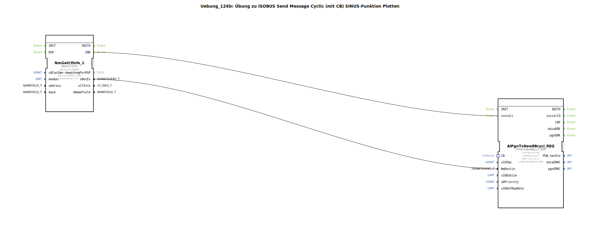

Hier ist die Dokumentationsseite für die Übung 126b.

# Uebung_126b: Übung zu ISOBUS Send Message Cyclic (mit CB) SINUS-Funktion Plotten

* * * * * * * * * *

## Einleitung
Die Übung **Uebung_126b** demonstriert das zyklische Senden einer ISOBUS-Nachricht, bei der die Nutzdaten (Data Payload) dynamisch über einen Callback-Mechanismus generiert werden. Konkret wird eine Sinus-Funktion erzeugt, deren Werte in das erste Byte der CAN-Nachricht geschrieben werden. Dies dient beispielsweise dazu, Signalverläufe zu simulieren und diese anschließend in Diagnose-Tools wie dem PCAN-Explorer zu plotten.

Das Hauptmerkmal dieser Übung ist die Trennung von Kommunikationsmanagement (im Haupt-Netzwerk) und Datengenerierung (in einer Sub-Application), verbunden über einen Adapter.

## Verwendete Funktionsbausteine (FBs)

### Haupt-Netzwerk
Im Hauptnetzwerk werden folgende Bausteine verwendet, um die Kommunikation zu initiieren:

*   **NmGetCfInfo_1** (`isobus::pgn::NmGetCfInfo`):
    *   Dient zum Abrufen von Netzwerkinformationen und Filtern der Zieladresse.
    *   Parameter:
        *   `u8CanIdx` = `NODE1`
        *   `member` = `network`
        *   `address` = `PEAK_ADD`
        *   `mask` = `PEAK_FLT`

*   **AlPgnTxNew8Bcycl_REQ** (`isobus::pgn::tx::AlPgnTxNew8Bcycl_REQ`):
    *   Dieser Baustein ist für das zyklische Senden einer 8-Byte großen Nachricht zuständig.
    *   Er verfügt über einen Adapter-Anschluss (`CB`), über den die Datenanforderung (Callback) abgewickelt wird.
    *   Parameter:
        *   `u32Pgn` = `61184` (Die verwendete Parameter Group Number)
        *   `u16DaSize` = `8` (Datenlänge in Bytes)
        *   `u8Priority` = `3` (Priorität der Nachricht)
        *   `u16DefRepRate` = `500` (Zykluszeit in Millisekunden)

*   **DataSupply** (`Uebungen::Uebung_126b_sub`):
    *   Eine Sub-Application, welche die Logik zur Datenerzeugung (Sinus-Kurve) enthält.

### Sub-Bausteine: DataSupply (Uebung_126b_sub)
Diese Sub-Application kapselt die Logik zur Berechnung der Sinuswerte.

*   **Typ**: SubApp
*   **Verwendete interne FBs**:
    *   **CallbackFB**: `isobus::pgn::tx::CallbackFB`
        *   Dieser Baustein dient als Schnittstelle zum zyklischen Sender. Wenn der Sender Daten benötigt, triggert dieser FB die Berechnungskette.
        *   Parameter: `DI1` (Eingang für die berechneten Datenstruktur)
    *   **GEN_SIN**: `OSCAT::Basic::POUs::Engineering::signal_generators::GEN_SIN`
        *   Erzeugt ein sinusförmiges Signal.
        *   Parameter:
            *   `PT` = `T#10s` (Periodendauer)
            *   `AM` = `10.0` (Amplitude)
            *   `OS` = `5.0` (Offset/Verschiebung)
            *   `DL` = `0.0`
    *   **F_LREAL_TO_USINT**: `iec61131::conversion::F_LREAL_TO_USINT`
        *   Konvertiert den Gleitkommawert des Sinus-Generators in eine vorzeichenlose kleine Ganzzahl (USINT).
    *   **F_USINT_TO_BYTE**: `iec61131::conversion::F_USINT_TO_BYTE`
        *   Wandelt den USINT-Wert in ein Byte um.
    *   **BYTES_TO_ARR08B**: `logiBUS::utils::conversion::arr::reversing::BYTES_TO_ARR08B`
        *   Erstellt ein Byte-Array aus 8 Einzelbytes.
        *   Der berechnete Sinus-Wert wird an `IN_00` angelegt.
        *   Parameter `IN_01` bis `IN_07` sind statisch `16#00`.
    *   **STRUCT_MUX**: `eclipse4diac::convert::STRUCT_MUX`
        *   Verpackt das Byte-Array in die `isobus::pgn::CAN_MSG` Struktur.
        *   Attribut: `StructuredType` = `isobus::pgn::CAN_MSG`

*   **Funktionsweise**:
    Sobald der `CallbackFB` ein Event empfängt (getriggert durch den zyklischen Sender im Hauptprogramm), aktiviert er den `GEN_SIN`. Der aktuelle Sinuswert wird berechnet, konvertiert (LREAL -> USINT -> BYTE) und in das erste Byte eines Arrays geschrieben. Dieses Array wird in eine CAN-Nachricht-Struktur verpackt und über den `CallbackFB` zurück an das Hauptprogramm gegeben.

## Programmablauf und Verbindungen

1.  **Initialisierung**: Der Baustein `NmGetCfInfo_1` ermittelt beim Start die notwendigen Netzwerkinformationen.
2.  **Konfiguration**: Sobald die Netzwerkinformationen verfügbar sind (`IND` Event), wird der Senderbaustein `AlPgnTxNew8Bcycl_REQ` installiert (`install`).
3.  **Zyklischer Betrieb**:
    *   Der `AlPgnTxNew8Bcycl_REQ` Baustein ist auf eine Wiederholrate von 500ms eingestellt.
    *   Alle 500ms löst er über den Adapter-Anschluss `CB` (verbunden mit `DataSupply.PLUG1`) eine Anfrage aus.
4.  **Datenberechnung**:
    *   Innerhalb der Sub-App `DataSupply` empfängt der `CallbackFB` die Anfrage.
    *   Dies triggert die Signalkette: Der Sinus-Generator `GEN_SIN` berechnet den nächsten Wert basierend auf der aktuellen Zeit.
    *   Aufgrund der Parameter (Amplitude 10, Offset 5) erzeugt der Generator Werte im Bereich von -5.0 bis +15.0. Da die Konvertierung auf `USINT` erfolgt, werden negative Werte typischerweise auf 0 geklemmt.
5.  **Rückgabe und Senden**:
    *   Der berechnete Wert landet im ersten Byte der Nutzdaten.
    *   Die Daten werden über den Adapter zurück an `AlPgnTxNew8Bcycl_REQ` geleitet.
    *   Der Baustein sendet die PGN 61184 mit den aktuellen Daten auf den CAN-Bus.

**Lernziele:**
*   Verständnis des Adapter-Konzepts (Plugs/Sockets) in 4diac.
*   Nutzung von Callback-Mechanismen für "Just-in-Time" Datenerzeugung bei zyklischen Sendern.
*   Verwendung von OSCAT-Bibliotheksbausteinen (`GEN_SIN`) zur Signalsimulation.
*   Datenkonvertierung und Strukturierung für ISOBUS/CAN-Nachrichten.

## Zusammenfassung
Die Übung 126b zeigt eine elegante Methode, um Simulationsdaten (hier eine Sinuskurve) über den ISOBUS zu senden. Durch die Auslagerung der Datenerzeugung in eine Sub-Applikation und die Nutzung der Callback-Schnittstelle bleibt die Hauptanwendung übersichtlich und der zyklische Sender kümmert sich autonom um das Timing, während die aktuellen Daten bei jedem Zyklus frisch berechnet werden. Das Ergebnis kann im PCAN-Explorer als Wellenform visualisiert werden (Byte 0 der Nachricht).