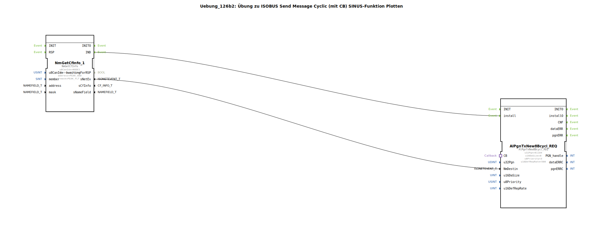

Hier ist die Dokumentation für die Übung **Uebung_126b2** basierend auf den bereitgestellten Daten.

# Uebung_126b2: Übung zu ISOBUS Send Message Cyclic (mit CB) SINUS-Funktion Plotten

* * * * * * * * * *

## Einleitung

Diese Übung demonstriert das zyklische Senden einer ISOBUS-Nachricht, deren Dateninhalt dynamisch zur Laufzeit generiert wird. Konkret wird eine Sinus-Funktion erzeugt, deren Werte in eine CAN-Nachricht verpackt und über das Netzwerk gesendet werden. Dies eignet sich beispielsweise, um Signale im "PCAN Explorer" zu plotten.

Ein besonderes Merkmal dieser Übung ist die Verwendung des **Callback-Mechanismus**. Anstatt die Daten statisch bereitzustellen, fordert der Sendebaustein (`AlPgnTxNew8Bcycl_REQ`) über eine Adapter-Verbindung (`CB`) neue Daten an, kurz bevor das Paket gesendet wird.

## Verwendete Funktionsbausteine (FBs)

In der Hauptanwendung werden folgende Bausteine verwendet, um die Netzwerkkommunikation zu initiieren und den Sendevorgang zu steuern:

*   **NmGetCfInfo_1** (`isobus::pgn::NmGetCfInfo`):
    *   Dieser Baustein ermittelt notwendige Netzwerkinformationen (z.B. Source Address) für einen bestimmten Knoten (`NODE1`).
    *   Er filtert auf bestimmte Parameter (`PEAK_ADD`, `PEAK_FLT`).
*   **AlPgnTxNew8Bcycl_REQ** (`isobus::pgn::tx::AlPgnTxNew8Bcycl_REQ`):
    *   Dieser Baustein ist für das zyklische Senden der Nachricht verantwortlich.
    *   **Parameter**:
        *   `u32Pgn`: 61184 (Die Ziel-PGN).
        *   `u16DaSize`: 8 (Datenlänge in Bytes).
        *   `u8Priority`: 3 (Priorität der Nachricht).
        *   `u16DefRepRate`: 500 (Wiederholrate in Millisekunden).

### Sub-Bausteine: DataSupply (Uebung_126b2_sub)

Die eigentliche Datenerzeugung findet in einem gekapselten Sub-Baustein statt.

*   **Typ**: `Uebung_126b2_sub`
*   **Beschreibung**: Erzeugt eine Sinus-Funktion und stellt diese über ein Callback-Interface bereit.
*   **Verwendete interne FBs**:
    *   **GEN_SIN**: `OSCAT::Basic::POUs::Engineering::signal_generators::GEN_SIN`
        *   Dient zur Erzeugung des Sinus-Signals.
        *   Parameter:
            *   `PT` (Periodendauer) = `T#10s`
            *   `AM` (Amplitude) = `10.0`
            *   `OS` (Offset) = `5.0`
    *   **F_REAL_TO_DWORD**: `iec61131::conversion::F_REAL_TO_DWORD`
        *   Konvertiert den `REAL`-Wert des Sinus-Generators in ein `DWORD`.
    *   **BYTES_TO_ARR08B**: `logiBUS::utils::conversion::arr::reversing::DWORDS_TO_ARR08B`
        *   Wandelt das `DWORD` Format in ein Byte-Array um, das für die CAN-Nachricht benötigt wird.
    *   **STRUCT_MUX**: `eclipse4diac::convert::STRUCT_MUX`
        *   Erstellt die Struktur `isobus::pgn::CAN_MSG` aus den konvertierten Daten.
    *   **CallbackFB**: `isobus::pgn::tx::CallbackFB`
        *   Stellt die Verbindung zum Adapter `PLUG1` her und triggert die Berechnung, wenn der Sende-Baustein Daten anfordert.

*   **Funktionsweise**:
    Sobald der Sende-Baustein im Hauptnetzwerk bereit ist zu senden, triggert er über den Adapter den `CallbackFB`. Dieser fordert (`REQ`) beim `GEN_SIN` den nächsten Wert an. Der berechnete Sinus-Wert wird konvertiert, in ein Byte-Array zerlegt und in eine CAN-Nachrichtenstruktur verpackt. Diese Struktur wird über den Adapter zurück an den Sende-Baustein gegeben.

## Programmablauf und Verbindungen

1.  **Initialisierung**:
    *   Zuerst wird der Baustein `NmGetCfInfo_1` ausgeführt, um die Netzwerkkonfiguration für `NODE1` zu laden.
    *   Sobald die Informationen verfügbar sind (`IND`-Event), wird der zyklische Sender `AlPgnTxNew8Bcycl_REQ` über den Eingang `install` initialisiert.

2.  **Zyklisches Senden**:
    *   Der `AlPgnTxNew8Bcycl_REQ` ist auf eine Zykluszeit von **500 ms** eingestellt.
    *   Alle 500 ms wird der Sendevorgang angestoßen.

3.  **Datenerzeugung (Callback)**:
    *   Der Sender ist über eine Adapter-Verbindung (`CB` <-> `PLUG1`) mit dem Sub-Baustein `DataSupply` verbunden.
    *   Vor dem Senden ruft der Sender den Sub-Baustein auf.
    *   Im Sub-Baustein wird der aktuelle Wert der Sinus-Kurve berechnet (Periode 10s, Amplitude 10, Offset 5).
    *   Der Wert wird in das passende Datenformat (Array of Byte) gewandelt und zurückgegeben.

4.  **Ausgabe**:
    *   Die PGN 61184 wird mit den aktuellen Sinus-Daten auf den Bus geschrieben. Externe Tools (wie PCAN Explorer) können diese Daten visualisieren.

## Zusammenfassung

Diese Übung vermittelt, wie man in 4diac ISOBUS-Anwendungen erstellt, die Daten nicht nur statisch, sondern dynamisch zur Laufzeit berechnen. Durch die Nutzung des Callback-Musters wird eine effiziente Trennung zwischen dem Kommunikationsmanagement (zyklisches Senden) und der Anwendungslogik (Signalgenerierung) erreicht. Das Ergebnis ist eine auf dem CAN-Bus sichtbare Sinus-Schwingung.