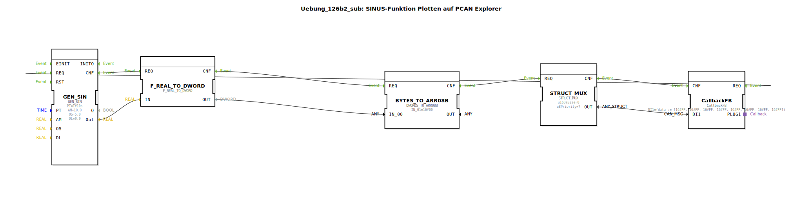

# Uebung_126b2_sub:  SINUS-Funktion Plotten auf PCAN Explorer

* * * * * * * * * *

## Einleitung

Diese Übung zeigt, wie mit Hilfe von 4diac und der CAN-Kommunikation eine Sinusfunktion generiert und über den CAN-Bus an einen PCAN Explorer gesendet werden kann. Der generierte Sinuswert wird in ein Byte-Array umgewandelt, in eine CAN-Nachricht verpackt und über einen Callback-Mechanismus versendet. Ziel ist es, die sinusförmige Ausgabe auf dem PCAN Explorer darzustellen.

## Verwendete Funktionsbausteine (FBs)

Die Übung verwendet die folgenden Funktionsbausteine innerhalb des Subapplikations-Subbausteins `Uebung_126b2_sub`:

- **GEN_SIN** (Typ: `OSCAT::Basic::POUs::Engineering::signal_generators::GEN_SIN`)  
  Erzeugt einen sinusförmigen Signalverlauf.  
  - Parameter:  
    - `PT` = T#10s (Periodendauer 10 Sekunden)  
    - `AM` = 10.0 (Amplitude)  
    - `OS` = 5.0 (Offset)  
    - `DL` = 0.0 (Verzögerung)  
  - Ereignisausgang `CNF` signalisiert Berechnung abgeschlossen.  
  - Datenausgang `Out` liefert den aktuellen Sinuswert (REAL).

- **F_REAL_TO_DWORD** (Typ: `iec61131::conversion::F_REAL_TO_DWORD`)  
  Wandelt den REAL-Sinuswert in ein DWORD (32-Bit) um.  
  - Ereigniseingang `REQ`, Ausgang `CNF`.  
  - Dateneingang `IN`, Datenausgang `OUT`.

- **BYTES_TO_ARR08B** (Typ: `logiBUS::utils::conversion::arr::reversing::DWORDS_TO_ARR08B`)  
  Konvertiert ein DWORD in ein Array von 8 Bytes (umgekehrte Byte-Reihenfolge).  
  - Parameter: `IN_01` = 16#00 (zweites DWORD auf null gesetzt, da nur ein DWORD verarbeitet wird).  
  - Dateneingang `IN_00` erhält das konvertierte DWORD von `F_REAL_TO_DWORD`.  
  - Datenausgang `OUT` liefert das Byte-Array.

- **STRUCT_MUX** (Typ: `eclipse4diac::convert::STRUCT_MUX`)  
  Baut aus den Eingangsdaten eine Struktur vom Typ `isobus::pgn::CAN_MSG` zusammen.  
  - Parameter:  
    - `StructuredType` = `isobus::pgn::CAN_MSG`  
    - `u16DaSize` = 0 (Längenfeld)  
    - `u8Priority` = 7 (CAN-Priorität)  
  - Ereigniseingang `REQ`, Ausgang `CNF`.  
  - Dateneingang `data` erhält das Byte-Array von `BYTES_TO_ARR08B`.  
  - Datenausgang `OUT` liefert die fertige CAN-Nachricht.

- **CallbackFB** (Typ: `isobus::pgn::tx::CallbackFB`)  
  Sendet die CAN-Nachricht über den Adapter `PLUG1` an den PCAN Explorer.  
  - Parameter: `DI1` = `(data := [16#FF, 16#FF, ...])` (dieser Wert wird durch die Verbindung von `STRUCT_MUX.OUT` überschrieben).  
  - Ereigniseingang `CNF` zum Auslösen des Sendens.  
  - Ausgang `REQ` (Trigger für nächsten Zyklus).  
  - Adapterausgang `PLUG1` verbindet sich mit dem äußeren Plug.

## Programmablauf und Verbindungen

Der Ablauf ist zyklisch und wird durch die Ereignisverkettung gesteuert:

1. **Start**: Der Baustein `CallbackFB` sendet ein `REQ`-Ereignis an `GEN_SIN`.
2. **Sinusgenerierung**: `GEN_SIN` berechnet den aktuellen Sinuswert und sendet `CNF` an `F_REAL_TO_DWORD`.
3. **Typumwandlung**: `F_REAL_TO_DWORD` wandelt den REAL-Wert in ein DWORD und sendet `CNF` an `BYTES_TO_ARR08B`.
4. **Byte-Konvertierung**: `BYTES_TO_ARR08B` zerlegt das DWORD in 8 Bytes (Big-Endian umgekehrt) und sendet `CNF` an `STRUCT_MUX`.
5. **Strukturaufbau**: `STRUCT_MUX` packt das Byte-Array in eine `CAN_MSG`-Struktur und sendet `CNF` an `CallbackFB`.
6. **Senden**: `CallbackFB` sendet die CAN-Nachricht über den Adapter `PLUG1` und triggert anschließend erneut `GEN_SIN` (über `REQ`), wodurch der Zyklus von vorne beginnt.

Die Datenverbindungen übertragen die entsprechenden Werte:
- `GEN_SIN.Out` → `F_REAL_TO_DWORD.IN`
- `F_REAL_TO_DWORD.OUT` → `BYTES_TO_ARR08B.IN_00`
- `BYTES_TO_ARR08B.OUT` → `STRUCT_MUX.data`
- `STRUCT_MUX.OUT` → `CallbackFB.DI1`

**Lernziele**:  
- Verständnis der Signalgenerierung mit `GEN_SIN`.  
- Umgang mit Typkonvertierungen (REAL → DWORD → Byte-Array).  
- Aufbau einer CAN-Nachricht mit `STRUCT_MUX`.  
- Einbindung von CAN-Kommunikation über `CallbackFB`.

**Schwierigkeitsgrad**: Mittel.  
**Vorkenntnisse**: Grundlagen der 4diac-IDE, Grundverständnis von CAN-Bus und Signalverarbeitung.

## Zusammenfassung

Die Übung realisiert eine zyklische Sinusgenerierung und sendet die Werte über CAN-Bus an einen PCAN Explorer. Durch die Verkettung mehrerer Funktionsbausteine wird der gesamte Weg vom analogen Signal bis zur seriellen CAN-Nachricht abgebildet. Der Subbaustein `Uebung_126b2_sub` kapselt diese Logik und kann in übergeordneten Anwendungen wiederverwendet werden.