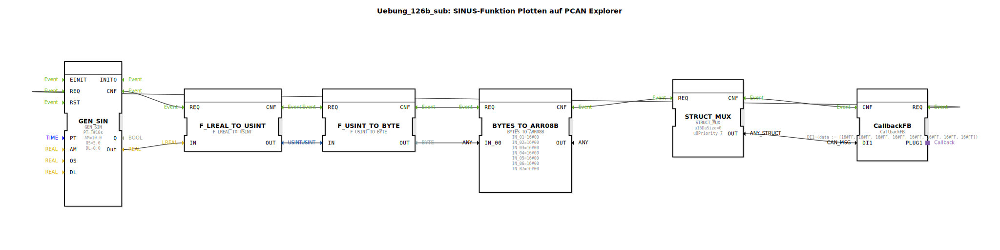

# Uebung_126b_sub:  SINUS-Funktion Plotten auf PCAN Explorer




* * * * * * * * * *

## Einleitung

Diese Übung demonstriert die Erzeugung eines Sinussignals mittels des Funktionsbausteins `GEN_SIN` und die Aufbereitung der Daten zur Übertragung über den CAN-Bus. Die generierten Werte werden in ein für den PCAN Explorer passendes Nachrichtenformat umgewandelt und über einen Callback-FB an den Adapter `isobus::pgn::tx::Callback` gesendet. Ziel ist es, die Signalgenerierung, Typkonvertierung und die Strukturierung von CAN‑Nachrichten in der 4diac‑IDE zu verstehen.

## Verwendete Funktionsbausteine (FBs)

| FB‑Name           | Typ                                                                 | Wichtige Parameter                                                                 | Kurzbeschreibung                                                                 |
|-------------------|---------------------------------------------------------------------|------------------------------------------------------------------------------------|----------------------------------------------------------------------------------|
| `GEN_SIN`         | OSCAT::Basic::POUs::Engineering::signal_generators::GEN_SIN         | PT = T#10s, AM = 10.0, OS = 5.0, DL = 0.0                                        | Erzeugt eine Sinusschwingung mit einer Periodendauer von 10 s, Amplitude 10 und Offset 5. |
| `F_LREAL_TO_USINT`| iec61131::conversion::F_LREAL_TO_USINT                             | –                                                                                  | Wandelt den Gleitkommawert (`LREAL`) in einen vorzeichenlosen 8‑Bit‑Wert (`USINT`). |
| `F_USINT_TO_BYTE` | iec61131::conversion::F_USINT_TO_BYTE                               | –                                                                                  | Konvertiert `USINT` in einen `BYTE`.                                              |
| `BYTES_TO_ARR08B` | logiBUS::utils::conversion::arr::reversing::BYTES_TO_ARR08B         | IN_01 … IN_07 = 16#00 (Initialwerte)                                              | Baut aus einem `BYTE`-Wert (IN_00) und sieben weiteren Bytes ein 8‑Byte‑Array auf (Reihenfolge umkehrend). |
| `STRUCT_MUX`      | eclipse4diac::convert::STRUCT_MUX                                   | StructuredType = "isobus::pgn::CAN_MSG", u16DaSize = 0, u8Priority = 7            | Setzt die empfangenen Daten in eine CAN‑Nachrichtenstruktur (`CAN_MSG`) zusammen. |
| `CallbackFB`      | isobus::pgn::tx::CallbackFB                                         | DI1 = (data := [16#FF, 16#FF, …]) (Initial‑Dummy)                                 | Sendet die fertige CAN‑Nachricht über den Adapter `PLUG1` an den PCAN Explorer.  |

## Programmablauf und Verbindungen

Die gesamte Verarbeitungskette wird durch das Ereignis `CallbackFB.REQ` gestartet. Danach durchlaufen die Daten die folgenden Schritte:

1. **Signalgenerierung**  
   `GEN_SIN` berechnet einen neuen Sinuswert und gibt diesen über den Datenausgang `Out` aus. Gleichzeitig wird das Ereignis `CNF` gesendet.

2. **Typkonvertierung LREAL → USINT**  
   Der Ausgang `GEN_SIN.Out` ist mit `F_LREAL_TO_USINT.IN` verbunden. Der Funktionsbaustein `F_LREAL_TO_USINT` wird durch das Ereignis `CNF` von `GEN_SIN` aktiviert und wandelt den Wert um. Sein Datenausgang `OUT` speist den nächsten Baustein.

3. **Typkonvertierung USINT → BYTE**  
   `F_USINT_TO_BYTE` erhält den `USINT`-Wert und gibt einen `BYTE`-Wert aus. Die Ereigniskette verläuft: `GEN_SIN.CNF` → `F_LREAL_TO_USINT.REQ` → `F_LREAL_TO_USINT.CNF` → `F_USINT_TO_BYTE.REQ`.

4. **Zusammenstellung des Byte-Arrays**  
   Der `BYTE`-Wert wird an `BYTES_TO_ARR08B.IN_00` angeschlossen. Die übrigen Eingänge (`IN_01 … IN_07`) sind auf `16#00` gesetzt. Der Baustein erzeugt ein 8‑Byte‑Array (Reihenfolge umkehrend) und signalisiert dies mit `CNF`.

5. **Strukturierung zur CAN‑Nachricht**  
   `STRUCT_MUX` wird durch das Ereignis von `BYTES_TO_ARR08B.CNF` getriggert. Es baut aus dem empfangenen Datenarray (Eingang `data`) und den voreingestellten Parametern (`u8Priority = 7`, `u16DaSize = 0`) eine CAN‑Nachricht vom Typ `isobus::pgn::CAN_MSG` auf. Der strukturierte Ausgang `OUT` wird an `CallbackFB.DI1` weitergeleitet.

6. **Senden über CAN**  
   `CallbackFB` erhält das Ereignis `CNF` von `STRUCT_MUX` und sendet die Nachricht über den Adapter `PLUG1` an den PCAN Explorer. Danach wird das nächste Ereignis über `CallbackFB.REQ` ausgelöst, sodass der Zyklus von Neuem beginnt.

Die Event‑ und Datenverbindungen sind im Diagramm der SubApp wie folgt realisiert (vereinfacht dargestellt):

```
CallbackFB.REQ  →  GEN_SIN.REQ
GEN_SIN.CNF     →  F_LREAL_TO_USINT.REQ
F_LREAL_TO_USINT.CNF  →  F_USINT_TO_BYTE.REQ
F_USINT_TO_BYTE.CNF   →  BYTES_TO_ARR08B.REQ
BYTES_TO_ARR08B.CNF   →  STRUCT_MUX.REQ
STRUCT_MUX.CNF        →  CallbackFB.CNF
```

Datenflüsse:  
`GEN_SIN.Out` → `F_LREAL_TO_USINT.IN` → `OUT` → `F_USINT_TO_BYTE.IN` → `OUT` → `BYTES_TO_ARR08B.IN_00` → `OUT` → `STRUCT_MUX.data` → `OUT` → `CallbackFB.DI1`

## Zusammenfassung

Die Übung veranschaulicht den gesamten Pfad von der analogen Signalgenerierung bis zur Ausgabe einer CAN‑Nachricht. Schrittweise werden Datentypen umgewandelt, ein Byte‑Array aufgebaut und in eine standardisierte CAN‑Struktur verpackt. Durch die Kopplung von Ereignis- und Datenflüssen wird ein periodischer, zyklischer Ablauf erreicht, der sich direkt für die Visualisierung oder Steuerung über den PCAN Explorer eignet.