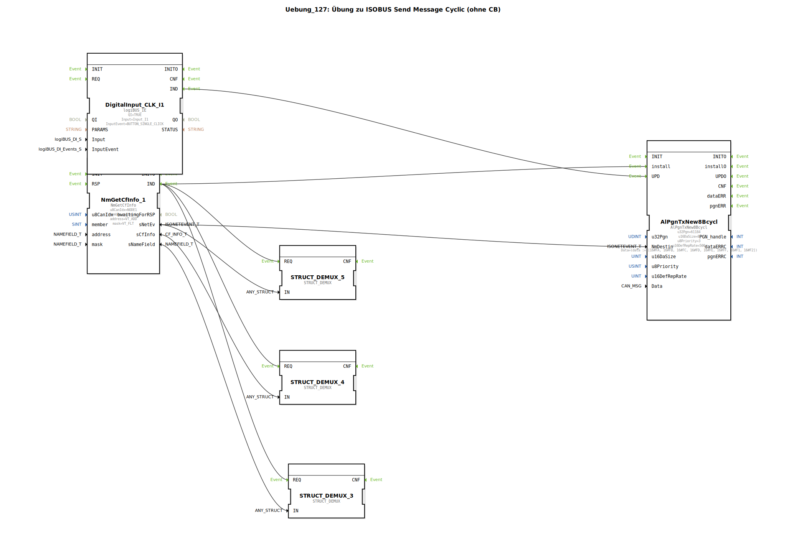

# Uebung_127: Übung zu ISOBUS Send Message Cyclic (ohne CB)

Dieser Artikel beschreibt die logiBUS®-Übung `Uebung_127`.

----

## Übersicht

[cite_start]Variante des zyklischen Sendens unter Verwendung von `AlPgnTxNew8Bcycl` ohne Callback[cite: 1].
In dieser Übung werden die zu sendenden Daten fest als Parameter am Baustein hinterlegt. Ein Ereignis am Eingang `UPD` (Update) ermöglicht es der Applikation jedoch, den Inhalt der Nachricht bei Bedarf zu ändern. Dies ist eine einfachere Alternative zum Callback, wenn sich die Daten nicht in jedem Zyklus ändern.

