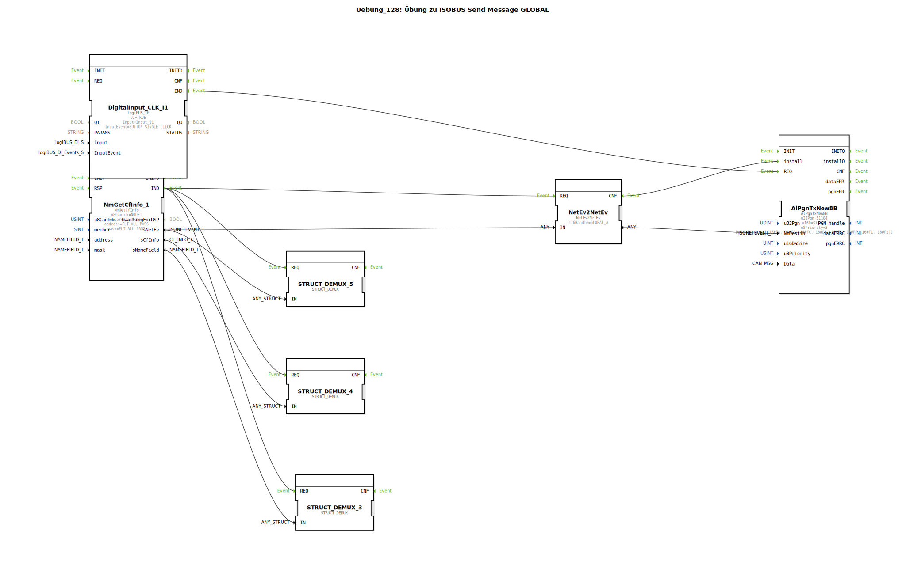

# Uebung_128: Übung zu ISOBUS Send Message GLOBAL

Dieser Artikel beschreibt die logiBUS®-Übung `Uebung_128`.

----

## Übersicht

[cite_start]In dieser Übung wird eine Nachricht an alle Teilnehmer im Netzwerk gleichzeitig gesendet (Broadcast)[cite: 1].
Dazu wird der Baustein `NetEv2NetEv` mit dem speziellen Handle `GLOBAL_A` (Adresse 255) genutzt. Die resultierende Netzwerk-Identität wird als Ziel (`NmDestin`) für den Sende-Baustein verwendet. Eine so gesendete Nachricht wird von jedem Gerät am ISOBUS empfangen und kann für allgemeine Informationen oder Synchronisations-Signale genutzt werden.

