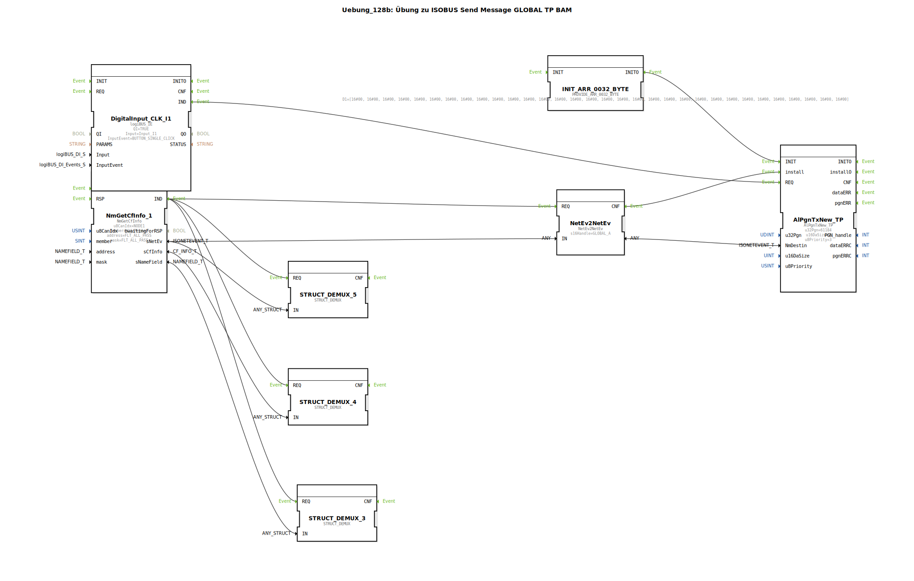

Hier ist die Dokumentation für die Übung `Uebung_128b` basierend auf den bereitgestellten Daten.

# Uebung_128b: Übung zu ISOBUS Send Message GLOBAL TP BAM

* * * * * * * * * *

## Einleitung

Diese Übung demonstriert das Senden einer ISOBUS-Nachricht unter Verwendung des **Transportprotokolls (TP)** mit der Methode **Broadcast Announce Message (BAM)**. Dabei wird eine Nachricht an die globale Adresse (Broadcast) gesendet. Da die Datenmenge 8 Bytes überschreitet (hier 32 Bytes), ist die Verwendung des Transportprotokolls notwendig.

## Verwendete Funktionsbausteine (FBs)

In dieser Übung werden verschiedene Funktionsbausteine verschaltet, um die Netzwerkkommunikation und Datenerzeugung zu realisieren.

### Hauptkomponenten

*   **isobus::pgn::NmGetCfInfo** (`NmGetCfInfo_1`)
    *   Dieser Baustein ruft Informationen über eine Control Function (CF) im Netzwerk ab.
    *   **Parameter**:
        *   `u8CanIdx`: `NODE1` (CAN-Knoten 1)
        *   `member`: `thisMember` (Bezieht sich auf den eigenen Teilnehmer)
        *   `address`, `mask`: `FLT_ALL_PASS` (Filtereinstellungen)
    *   **Funktion**: Er stellt Netzwerkereignisse (`sNetEv`) und Namensinformationen bereit, die für die Initialisierung des Sende-Bausteins benötigt werden.

*   **isobus::pgn::NetEv2NetEv** (`NetEv2NetEv`)
    *   Ein Konverter-Baustein, der Netzwerkereignisse verarbeitet und Zieladressen zuweist.
    *   **Parameter**:
        *   `s16Handle`: `GLOBAL_A` (Definiert das Ziel als globale Adresse/Broadcast).
    *   **Funktion**: Er wandelt das Netzwerkereignis des eigenen Geräts in ein Ereignis um, das für eine globale Übertragung (Broadcast) konfiguriert ist.

*   **isobus::pgn::tx::AlPgnTxNew_TP** (`AlPgnTxNew_TP`)
    *   Der eigentliche Sende-Baustein für PGNs unter Verwendung des Transportprotokolls (TP).
    *   **Parameter**:
        *   `u32Pgn`: `61184` (Proprietary A PGN).
        *   `u16DaSize`: `0` (Wird dynamisch überschrieben).
        *   `u8Priority`: `3`.
    *   **Eingänge**:
        *   `NmDestin`: Erhält die Zielinformation (Global) vom `NetEv2NetEv`.
        *   `Data`: Erhält die 32-Byte-Nutzdaten.
        *   `install`: Initialisiert den Sende-Handle.
        *   `REQ`: Löst das Senden aus.

*   **logiBUS::io::DI::logiBUS_IE** (`DigitalInput_CLK_I1`)
    *   Verarbeitet digitale Eingabesignale.
    *   **Parameter**:
        *   `Input`: `Input_I1`
        *   `InputEvent`: `BUTTON_SINGLE_CLICK`
    *   **Funktion**: Dient als Auslöser (Trigger) für den Sendevorgang.

*   **eclipse4diac::convert::providers::PROVIDE_ARR_0032_BYTE** (`INIT_ARR_0032_BYTE`)
    *   Erzeugt ein statisches Byte-Array.
    *   **Parameter**:
        *   `D1`: Ein Array mit 32 Bytes (beginnend mit `16#01, 16#00... 16#AA...`).
    *   **Funktion**: Stellt die Nutzdaten (Payload) für die ISOBUS-Nachricht bereit.

### Debugging / Visualisierung
Folgende Bausteine dienen der Aufschlüsselung von Strukturen zu Diagnosezwecken:
*   **eclipse4diac::convert::STRUCT_DEMUX** (`STRUCT_DEMUX_3`): Zerlegt `isobus::pgn::NAMEFIELD_T`.
*   **eclipse4diac::convert::STRUCT_DEMUX** (`STRUCT_DEMUX_4`): Zerlegt `isobus::pgn::CF_INFO_T`.
*   **eclipse4diac::convert::STRUCT_DEMUX** (`STRUCT_DEMUX_5`): Zerlegt `isobus::pgn::ISONETEVENT_T`.

## Programmablauf und Verbindungen

Der Ablauf der Übung gestaltet sich wie folgt:

1.  **Initialisierung**:
    *   Der Baustein `NmGetCfInfo_1` liefert Informationen über den eigenen Netzwerkknoten. Das `IND`-Ereignis triggert die nachfolgenden Schritte.
    *   Die Netzwerkinformationen (`sNetEv`) werden an `NetEv2NetEv` geleitet.
    *   Gleichzeitig stellt `INIT_ARR_0032_BYTE` ein 32-Byte-Datenpaket zur Verfügung und initialisiert den Dateneingang von `AlPgnTxNew_TP`.

2.  **Konfiguration des Senders**:
    *   Der Baustein `NetEv2NetEv` ist mit dem Handle `GLOBAL_A` konfiguriert. Das bedeutet, er bereitet den Sende-Baustein darauf vor, an die globale Adresse (255) zu senden.
    *   Das Ergebnis von `NetEv2NetEv` wird an den Eingang `NmDestin` des `AlPgnTxNew_TP` gelegt und über das Event `install` bestätigt. Damit weiß der Sender, dass er ein Broadcast-Telegramm senden soll.

3.  **Sendevorgang (TP BAM)**:
    *   Durch Betätigen des Tasters `Input_I1` (Single Click) am Baustein `DigitalInput_CLK_I1` wird das Event `REQ` am Sende-Baustein `AlPgnTxNew_TP` ausgelöst.
    *   Da die Datenlänge (32 Byte) größer als 8 Byte ist und das Ziel die globale Adresse ist, verwendet der Baustein automatisch das **BAM-Protokoll** (Broadcast Announce Message), um die Daten segmentiert zu übertragen.
    *   Gesendet wird die PGN 61184 (Proprietary A) mit Priorität 3.

## Zusammenfassung

In dieser Übung wird die Handhabung von ISOBUS-Transportprotokollen vertieft. Im Speziellen wird gezeigt, wie größere Datenmengen (> 8 Byte) mittels `AlPgnTxNew_TP` an alle Teilnehmer im Netzwerk (Broadcast) gesendet werden. Die Kombination aus der PGN-Konfiguration, der Datenquelle (`INIT_ARR`) und der Adressierung (`GLOBAL_A`) führt zur automatischen Aushandlung einer BAM-Übertragung.