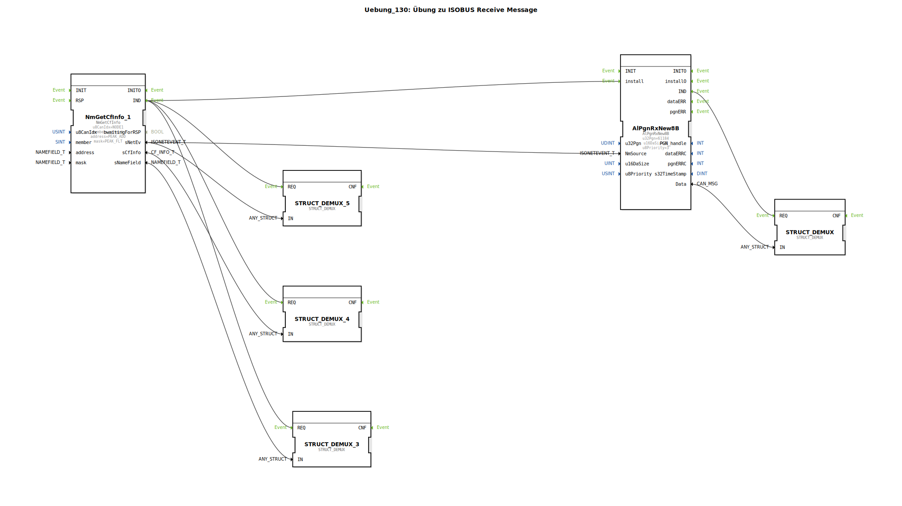

# Uebung_130: Übung zu ISOBUS Receive Message

Dieser Artikel beschreibt die logiBUS®-Übung `Uebung_130`. Hier wird das Gegenstück zum Senden gezeigt: Das gezielte Empfangen von herstellerspezifischen Nachrichten.

----

## Ziel der Übung

Verwendung des Bausteins `AlPgnRxNew8B`. Es wird demonstriert, wie man auf eine spezifische Nachricht (PGN) eines bestimmten Partners lauscht und den Inhalt für das eigene Programm auswertet.

-----

## Beschreibung und Komponenten

[cite_start]In `Uebung_130.SUB` wird ein Empfangs-Filter für eine herstellerspezifische PGN konfiguriert[cite: 1].

### Funktionsbausteine (FBs)

  * **`NmGetCfInfo_1`**: Identifiziert den Absender der Nachricht (Source).
  * **`AlPgnRxNew8B`**: Der Empfangs-Baustein. Er filtert alle CAN-Nachrichten und lässt nur die passende PGN durch.
  * **`STRUCT_DEMUX`**: Zerlegt die empfangene 8-Byte Nachricht wieder in einzelne Signale.

-----

## Funktionsweise

1.  Der Baustein wird über `install` im System registriert und mit dem gewünschten Absender (`NmSource`) verknüpft.
2.  Sobald der Partner die passende Nachricht (PGN `61184`) sendet, erkennt dies der Baustein.
3.  Er feuert das Ereignis `IND` (Indication) ab und stellt das Datenpaket am Port `Data` bereit.
4.  Über den Demultiplexer kann das Programm nun auf den Inhalt der Nachricht reagieren.

Dies ermöglicht eine private Kommunikation zwischen zwei spezifischen Geräten am Bus, ohne andere Teilnehmer zu stören.