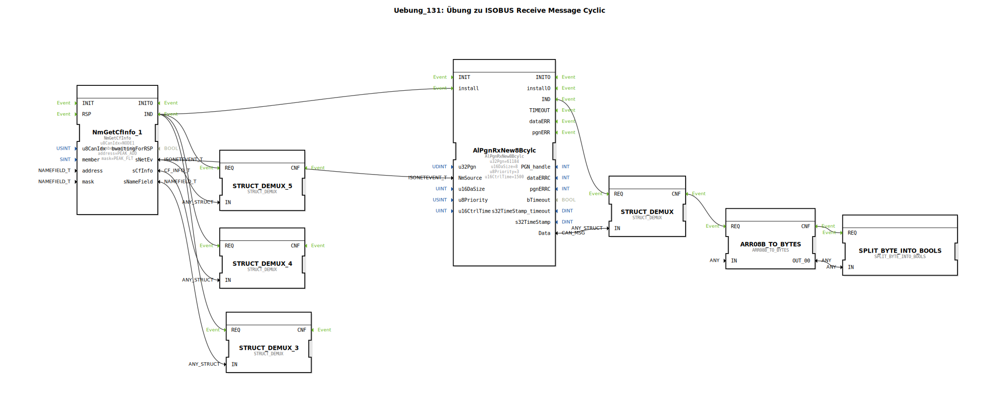

# Uebung_131: Übung zu ISOBUS Receive Message Cyclic

Dieser Artikel beschreibt die logiBUS®-Übung `Uebung_131`. Hier wird der Empfang von Nachrichten um eine Zeit-Überwachung (Timeout) ergänzt.

## 🎧 Podcast

* [Die drei Timer der DIN EN 61131-3 entschlüsselt – TP, TON & TOF präzise erklärt](https://podcasters.spotify.com/pod/show/iec-61499-grundkurs-de/episodes/Die-drei-Timer-der-DIN-EN-61131-3-entschlsselt--TP--TON--TOF-przise-erklrt-e3dma77)
* [DIN EN 61131-3 vs. 61499-1: Dein Wegweiser durch die Normen der Industrieautomatisierung](https://podcasters.spotify.com/pod/show/iec-61499-grundkurs-de/episodes/DIN-EN-61131-3-vs--61499-1-Dein-Wegweiser-durch-die-Normen-der-Industrieautomatisierung-e36c6nc)
* [DIN EN 61131-3: Das Herz der Land- und Baumaschinen-Mechatronik und der Sprung in die Zukunft mit Ob](https://podcasters.spotify.com/pod/show/iec-61499-grundkurs-de/episodes/DIN-EN-61131-3-Das-Herz-der-Land--und-Baumaschinen-Mechatronik-und-der-Sprung-in-die-Zukunft-mit-Ob-e36c2mp)
* [FB_TOF und E_TOF: Verzögerungstimer in IEC 61131-3 und 61499](https://podcasters.spotify.com/pod/show/iec-61499-grundkurs-de/episodes/FB_TOF-und-E_TOF-Verzgerungstimer-in-IEC-61131-3-und-61499-e368e2d)
* [IEC 61499 vs. 61131: Brauchen wir einen neuen Standard für IIoT? Analyse einer hitzigen Debatte um Verteilte Intelligenz](https://podcasters.spotify.com/pod/show/iec-61499-grundkurs-de/episodes/IEC-61499-vs--61131-Brauchen-wir-einen-neuen-Standard-fr-IIoT--Analyse-einer-hitzigen-Debatte-um-Verteilte-Intelligenz-e3ahc2r)

----

## Übersicht

[cite_start]Verwendung des Bausteins `AlPgnRxNew8Bcylc`[cite: 1].
Dieser Baustein ist speziell für Nachrichten gedacht, die regelmäßig (zyklisch) erwartet werden. Über den Parameter `u16CtrlTime = 1500`ms wird eine Kontrollzeit definiert. Sollte der Partner für länger als 1,5 Sekunden keine Nachricht mehr senden, wird dies als Kommunikationsabbruch gewertet. Die Applikation kann auf diesen Fehlerfall reagieren, um die Maschine in einen sicheren Zustand zu bringen.