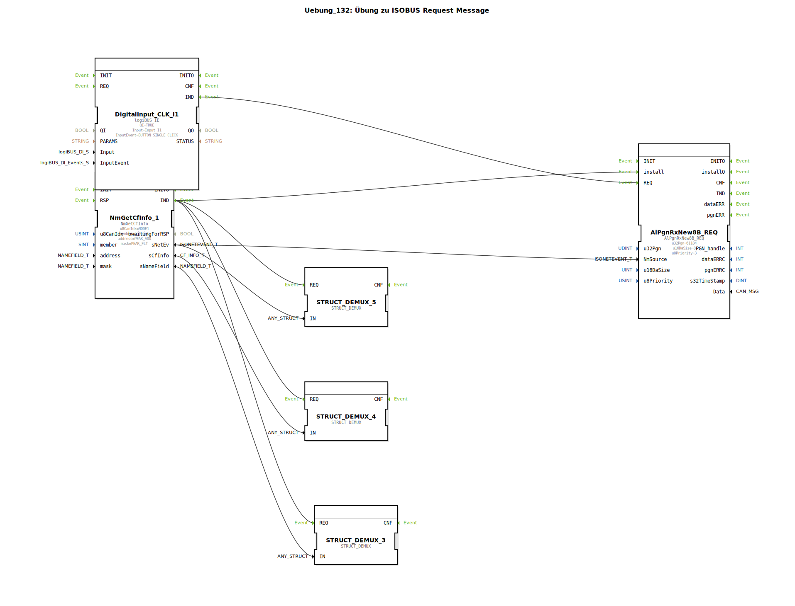

# Uebung_132: Übung zu ISOBUS Request Message

Dieser Artikel beschreibt die logiBUS®-Übung `Uebung_132`.

----

## Übersicht

[cite_start]In dieser Übung wird der Baustein `AlPgnRxNew8B_REQ` verwendet[cite: 1].

Anstatt passiv auf eine Nachricht zu warten, kann die Steuerung hier aktiv eine Anfrage (Request) nach einer bestimmten PGN an den Partner senden. Ein Klick auf Taster **I1** löst das `REQ`-Ereignis aus, woraufhin die Steuerung die entsprechende Anforderungs-Nachricht auf den Bus schickt. Sobald der Partner antwortet, wird dies als regulärer Empfang (`IND`) gewertet und verarbeitet.