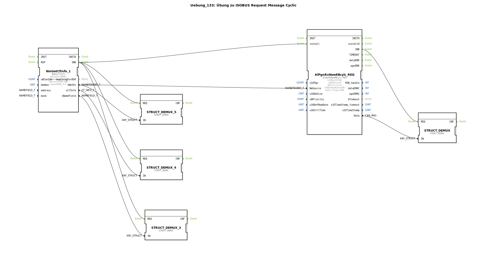

# Uebung_133: Übung zu ISOBUS Request Message Cyclic

Dieser Artikel beschreibt die logiBUS®-Übung `Uebung_133`.

----

## Übersicht

[cite_start]Kombination aus Abfrage und zyklischer Überwachung unter Verwendung von `AlPgnRxNew8Bcylc_REQ`[cite: 1].
Dieser Baustein sendet in festen Abständen eigenständig Anfragen an den Partner und überwacht gleichzeitig das Eintreffen der Antworten innerhalb der Kontrollzeit. Dies ist die sicherste Form der Kommunikation für Daten, die nicht automatisch vom Partner gesendet werden, aber dennoch permanent aktuell sein müssen.

