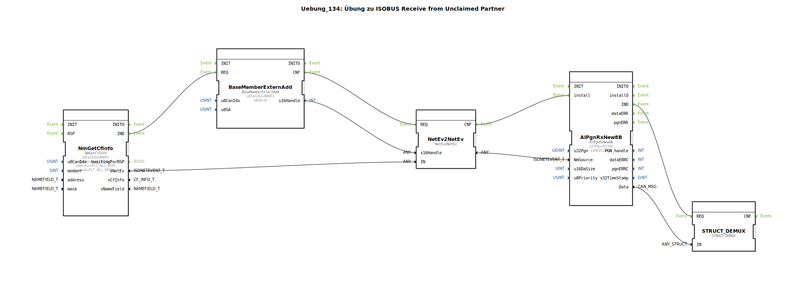

# Uebung_134: Übung zu ISOBUS Receive from Unclaimed Partner

Dieser Artikel beschreibt die logiBUS®-Übung `Uebung_134`.

----

## Übersicht

[cite_start]In dieser Übung wird eine Lösung für die Kommunikation mit Geräten gezeigt, die kein standardkonformes ISOBUS-Management (Address Claiming) durchführen[cite: 1].
Unter Verwendung des Bausteins `BaseMemberExternAdd` wird manuell ein Kommunikations-Handle für eine feste Quelladresse (hier `u8SA = 55`) erstellt. Dieses Handle wird genutzt, um Nachrichten von einem "Unclaimed Partner" zu empfangen, der seine Identität nicht über die Namensverwaltung preisgibt. Dies ist oft bei der Integration von einfachen Sensoren oder Altgeräten notwendig.

