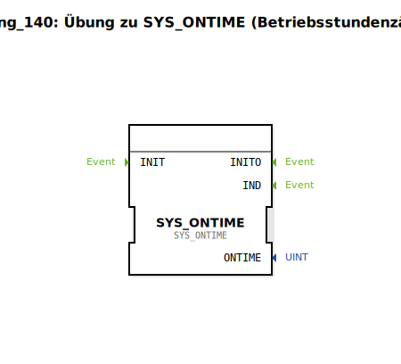

# Uebung_140: Übung zu SYS_ONTIME (Betriebsstundenzähler)

Dieser Artikel beschreibt die logiBUS®-Übung `Uebung_140`. Hier wird die Erfassung der Systemlaufzeit demonstriert.

## 🎧 Podcast

* [Von 1400 Fehlern zum sauberen Code: Die Migration der „Getreidehacke“ auf Eclipse 4diac™ 3.0 und die Macht der AX-Adapter](https://podcasters.spotify.com/pod/show/logibus/episodes/Von-1400-Fehlern-zum-sauberen-Code-Die-Migration-der-Getreidehacke-auf-Eclipse-4diac-3-0-und-die-Macht-der-AX-Adapter-e3ahcko)

----

## Ziel der Übung

Verwendung des Bausteins `SYS_ONTIME`. Ziel ist es, die kumulierte Zeit zu erfassen, in der die Steuerung eingeschaltet und aktiv ist.

-----

## Beschreibung und Komponenten

[cite_start]Die Subapplikation `Uebung_140.SUB` nutzt einen speziellen Messbaustein zur Zeitüberwachung[cite: 1].

### Funktionsbausteine (FBs)

  * **`SYS_ONTIME`**: Typ `logiBUS::signalprocessing::measurement::SYS_ONTIME`. [cite_start]Dieser Baustein misst die Zeit seit dem letzten Systemstart oder die kumulierte Gesamtzeit (je nach Implementierung)[cite: 1].

-----

## Funktionsweise

Der Baustein läuft im Hintergrund mit. Er bietet typischerweise Ausgänge für Sekunden, Minuten und Stunden. Diese Daten können dann dauerhaft gespeichert (NVS) oder auf dem Service-Menü des Terminals angezeigt werden.

-----

## Anwendungsbeispiel

**Wartungsintervalle**:
Die Steuerung zählt die Betriebsstunden der Maschine. Sobald ein Grenzwert (z.B. 500 Stunden) erreicht ist, wird dem Bediener am Terminal eine Meldung angezeigt: "Ölwechsel erforderlich". Dies garantiert die Einhaltung von Wartungsplänen und erhöht die Lebensdauer der Maschine.