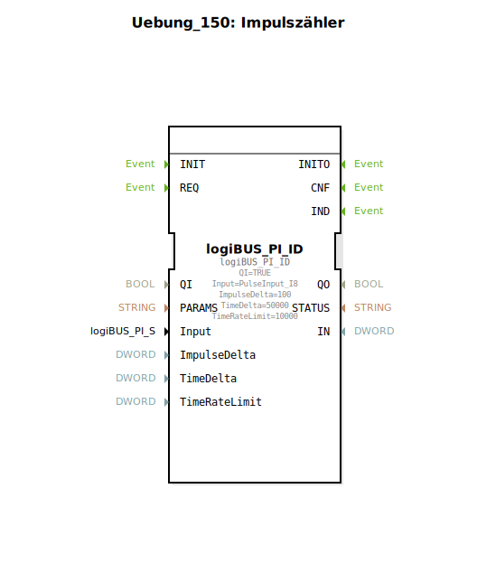

Hier ist die Dokumentation für die Übung `Uebung_150` basierend auf den bereitgestellten Daten.

# Uebung_150: Impulszähler

* * * * * * * * * *

## Einleitung
Die Übung **Uebung_150** implementiert eine Sub-Applikation (SubApp), die als "Impulszähler" fungiert. Sie dient der Konfiguration und Einbindung eines hardwareseitigen Pulse-Inputs über das logiBUS-System. Ziel ist es, eine Schnittstelle zu einem physikalischen Eingang (`PulseInput_I8`) herzustellen und Parameter für die Erfassung festzulegen.

## Verwendete Funktionsbausteine (FBs)

In dieser SubApp wird ein spezifischer Funktionsbaustein verwendet, um die Kommunikation mit der Hardware zu konfigurieren.

### Sub-Bausteine: logiBUS_PI_ID

Dieser Baustein ist die zentrale Komponente der Übung und stellt die Verbindung zur Hardware-Eingangsschicht her.

- **Typ**: `logiBUS::io::PI::logiBUS_PI_ID`
- **Verwendete interne FBs**:
    - **Bausteinname**: `logiBUS_PI_ID`
        - **Typ**: `logiBUS::io::PI::logiBUS_PI_ID`
        - **Parameter**:
            - `QI` = `TRUE` (Aktivierung des Bausteins/Initialisierung)
            - `Input` = `PulseInput_I8` (Zuweisung des spezifischen Hardware-Eingangs)
            - `ImpulseDelta` = `100` (Schwellenwert für Impulsänderungen)
            - `TimeDelta` = `50000` (Zeitintervall für die Aktualisierung/Messung)
        - **Ereignisausgang/-eingang**: *Keine expliziten Verbindungen im XML definiert.*
        - **Datenausgang/-eingang**: *Keine expliziten Verbindungen im XML definiert.*

- **Funktionsweise**:
    Der Baustein `logiBUS_PI_ID` initialisiert einen Pulse-Input-Kanal. Durch das Setzen von `QI` auf `TRUE` wird der Baustein aktiviert. Der Parameter `Input` legt fest, dass der physikalische Eingang `PulseInput_I8` verwendet wird. Die Parameter `ImpulseDelta` und `TimeDelta` konfigurieren die Empfindlichkeit und das Zeitverhalten des Zählers, was steuert, wann und wie oft Aktualisierungen über den Bus gesendet oder verarbeitet werden.

## Programmablauf und Verbindungen

Da es sich bei dieser Übung um eine reine Konfiguration eines Hardware-Treibers innerhalb einer SubApp handelt, gibt es keinen komplexen Programmablauf oder Verschaltungen zwischen mehreren Bausteinen.

- **Initialisierung**: Der Baustein ist statisch parametriert. Beim Start der Applikation wird der Hardware-Treiber mit den Werten `100` für das Impuls-Delta und `50000` für das Zeit-Delta geladen.
- **Schnittstellen**: Die SubApp `Uebung_150` selbst definiert keine externen Ein- oder Ausgänge in ihrer `SubAppInterfaceList`. Sie wirkt als in sich geschlossenes Konfigurationsmodul für den logiBUS.
- **Lernziele**:
    - Verständnis der Anbindung von Hardware-Inputs über logiBUS.
    - Konfiguration von Zählerparametern (Delta-Werte).
    - Umgang mit SubApp-Typen zur Kapselung von Hardware-Konfigurationen.

## Zusammenfassung
Die Übung **Uebung_150** stellt eine grundlegende Konfiguration für einen Impulszähler dar. Sie nutzt den Baustein `logiBUS_PI_ID`, um den Hardware-Eingang `PulseInput_I8` mit spezifischen Parametern für Impuls- und Zeitintervalle zu initialisieren. Diese Übung ist essenziell für das Verständnis der Hardware-Abstraktionsschicht in 4diac-Systemen, die logiBUS verwenden.