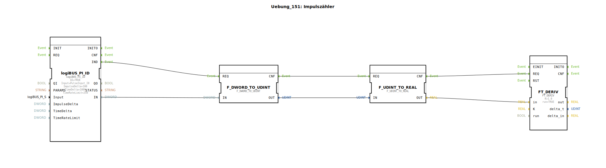

Hier ist die Dokumentation für die Übung 151 basierend auf den bereitgestellten Daten.

# Uebung_151: Impulszähler

*(Hier Bild der Übung einfügen, falls vorhanden)*

* * * * * * * * * *

## Einleitung
Diese Übung implementiert eine Sub-Applikation (`SubAppType`) mit dem Namen **Uebung_151**. Ziel der Übung ist die Erfassung und Verarbeitung von Impulssignalen über eine Hardwareschnittstelle. Die eingehenden Rohdaten werden konvertiert und anschließend wird mittels eines mathematischen Bausteins die Ableitung (Änderungsrate) berechnet. Dies dient typischerweise dazu, aus einem Zählerstand eine Geschwindigkeit oder Frequenz zu ermitteln.

## Verwendete Funktionsbausteine (FBs)

In dieser Übung werden verschiedene Standard- und Bibliotheksbausteine innerhalb des Netzwerks verwendet.

### Sub-Bausteine: Uebung_151 (Netzwerk-Komponenten)

Hier werden die internen Bausteine beschrieben, die im Netzwerk dieser SubApp verschaltet sind.

- **Verwendete interne FBs**:

    - **logiBUS_PI_ID**: `logiBUS::io::PI::logiBUS_PI_ID`
        - Dieser Baustein stellt die Schnittstelle zur Hardware (Pulse Input) dar.
        - **Parameter**:
            - `QI` = `TRUE` (Aktiviert den Baustein)
            - `Input` = `PulseInput_I8` (Referenz auf den physikalischen Eingang)
            - `ImpulseDelta` = `100`
            - `TimeDelta` = `1000`
        - **Funktionsweise**: Er liefert Prozessdaten basierend auf den konfigurierten Parametern für den Impulseingang.

    - **F_DWORD_TO_UDINT**: `iec61131::conversion::F_DWORD_TO_UDINT`
        - **Typ**: Konvertierungsbaustein.
        - **Funktionsweise**: Wandelt den Datentyp `DWORD` (Doppelwort) in `UDINT` (Unsigned Double Integer) um. Dies ist notwendig, um die Rohdaten des Hardware-Bausteins für die mathematische Weiterverarbeitung vorzubereiten.

    - **F_UDINT_TO_REAL**: `iec61131::conversion::F_UDINT_TO_REAL`
        - **Typ**: Konvertierungsbaustein.
        - **Funktionsweise**: Wandelt den Datentyp `UDINT` in `REAL` (Gleitkommazahl) um. Die `REAL`-Darstellung wird für den nachfolgenden Ableitungsbaustein benötigt.

    - **FT_DERIV**: `OSCAT::Basic::POUs::Engineering::Control::FT_DERIV`
        - **Typ**: Regelungstechnischer Baustein (Ableitung).
        - **Parameter**:
            - `K` = `1.0` (Verstärkungsfaktor)
            - `run` = `TRUE` (Baustein ist aktiv)
        - **Funktionsweise**: Berechnet die zeitliche Ableitung des Eingangssignals. In diesem Kontext wird aus der Änderung des Zählerstandes (Impulse) über die Zeit die Frequenz bzw. Geschwindigkeit ermittelt.

## Programmablauf und Verbindungen

Der Ablauf der Übung wird durch die Ereignis- und Datenkette definiert:

1.  **Signalerfassung**: Der Baustein `logiBUS_PI_ID` erfasst Signale am Eingang `PulseInput_I8`. Sobald neue Daten verfügbar sind, wird das Ereignis `IND` ausgelöst und der Datenwert am Ausgang `IN` bereitgestellt.
2.  **Typkonvertierung**:
    *   Das Signal gelangt zunächst zum Baustein `F_DWORD_TO_UDINT`.
    *   Das Ergebnis wird an `F_UDINT_TO_REAL` weitergeleitet.
    *   Diese Kette sorgt dafür, dass das Signal von einem binären Rohformat (`DWORD`) in eine fließkomma-basierte Zahl (`REAL`) gewandelt wird.
3.  **Berechnung**:
    *   Der konvertierte `REAL`-Wert wird an den Eingang `in` des `FT_DERIV` Bausteins übergeben.
    *   Der `FT_DERIV` Baustein berechnet die Änderung des Eingangssignals pro Zeiteinheit. Da der Eingang ein akkumulierter Zählerstand (Impulse) ist, entspricht die Ableitung der aktuellen Impulsfrequenz (Impulse pro Sekunde/Minute, abhängig von der Zeitbasis).

**Lernziele:**
*   Einbindung von Hardware-Eingängen (LogiBUS).
*   Umgang mit Datentyp-Konvertierungen in IEC 61499 / IEC 61131.
*   Anwendung mathematischer Funktionen aus der OSCAT-Bibliothek zur Signalverarbeitung.

## Zusammenfassung
Die Übung **Uebung_151** zeigt den Aufbau eines Impulszählers mit nachgeschalteter Frequenzberechnung. Durch die Kombination aus Hardware-Treiber, Konvertierungslogik und dem Differenzierer (`FT_DERIV`) wird aus einfachen Zählimpulsen eine nutzbare Prozessgröße (z.B. Drehzahl oder Durchfluss) generiert.