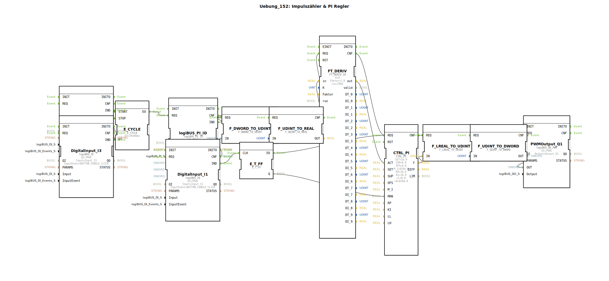

# Uebung_152: Impulszähler &amp; PI Regler

Dieser Artikel beschreibt die logiBUS®-Übung `Uebung_152`. Hier wird eine geschlossene Regelschleife (Closed Loop) implementiert.

----

## Ziel der Übung

Implementierung eines PI-Reglers zur Konstanthaltung einer physikalischen Größe.

-----

## Beschreibung und Komponenten

[cite_start]Die Subapplikation `Uebung_152.SUB` verbindet Sensorik, Regelung und Aktorik[cite: 1].

### Regelkreis-Komponenten

  * **Sensor (Ist-Wert)**: Impulszähler `logiBUS_PI_ID` + Ableitung `FT_DERIV` (berechnet z.B. die aktuelle Drehzahl).
  * **Regler**: `CTRL_PI` (OSCAT). Er vergleicht den Sollwert (`SET = 16.0`) mit dem Ist-Wert.
  * **Aktor (Stellgröße)**: `logiBUS_QD_PWM`. Ein pulsweitenmodulierter Ausgang, der z.B. einen Motor oder ein Ventil ansteuert.
  * **Bedienung**: Taster `I2` (Start) und `I3` (Stop) steuern den Zyklus. Taster `I1` schaltet zwischen Hand- und Automatikbetrieb um (`MAN` Eingang am Regler).

-----

## Funktionsweise

Der Regler versucht ständig, die Stellgröße am PWM-Ausgang so anzupassen, dass die gemessene Impulsrate dem Sollwert entspricht.
*   Wird das System belastet (Drehzahl sinkt), erhöht der Regler das PWM-Verhältnis.
*   Wird es zu schnell, drosselt er.

-----

## Anwendungsbeispiel

**Tempomat** oder **Konstanthaltung der Ausbringmenge**: Egal ob der Traktor bergauf oder bergab fährt, die Drehzahl der Säwelle soll exakt gleich bleiben.