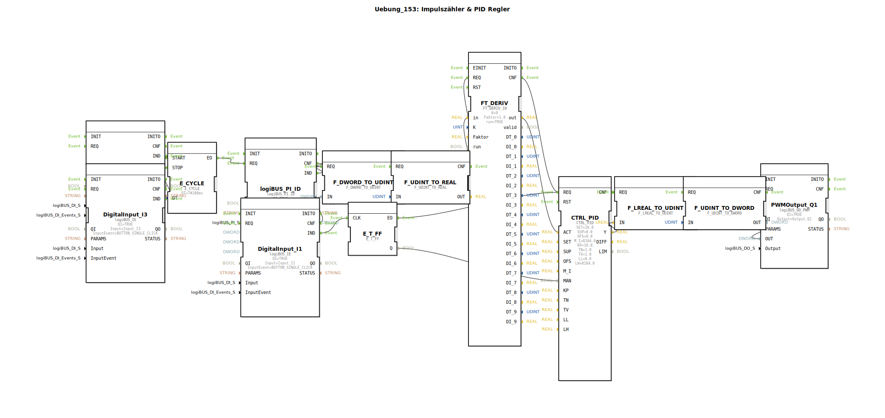

# Uebung_153: Impulszähler &amp; PID Regler

Dieser Artikel beschreibt die logiBUS®-Übung `Uebung_153`.

----

## Ziel der Übung

Präzisere Regelung durch einen PID-Algorithmus.

-----

## Beschreibung

[cite_start]Strukturell identisch zu `Uebung_152`, jedoch wird der Baustein `CTRL_PID` verwendet[cite: 1].
Zusätzlich zum P- und I-Anteil verfügt dieser über einen D-Anteil (`TV` Parameter), der auf die Änderungsgeschwindigkeit der Regelabweichung reagiert. Dies ermöglicht ein schnelleres Einregeln bei plötzlichen Störungen, erfordert aber eine sorgfältigere Parametrierung.

