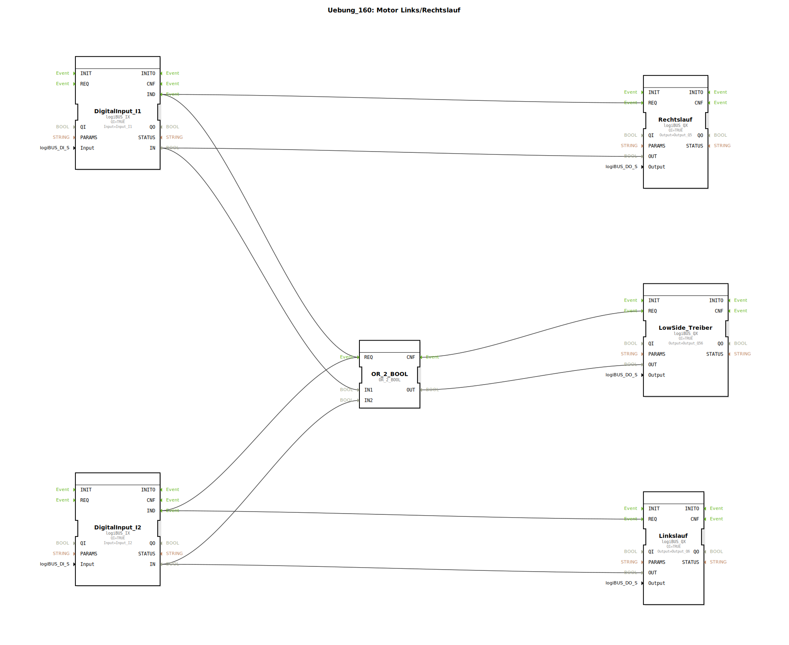

# Uebung_160: Motor Links/Rechtslauf

Dieser Artikel beschreibt die logiBUS®-Übung `Uebung_160`. Hier wird die einfache logische Verknüpfung zur Steuerung eines umschaltbaren Antriebs gezeigt.

----

## Ziel der Übung

Realisierung einer Steuerung für Linkslauf, Rechtslauf und ein Summensignal (Motor Aktiv).

-----

## Beschreibung und Komponenten

[cite_start]In `Uebung_160.SUB` werden zwei Taster auf drei Ausgänge gemappt[cite: 1].

### Funktionsbausteine (FBs)

  * **`I1`**: Taster für Linkslauf.
  * **`I2`**: Taster für Rechtslauf.
  * **`OR_2_BOOL`**: Logische ODER-Verknüpfung.
  * **`Q5`**: Ausgang Linkslauf.
  * **`Q6`**: Ausgang Rechtslauf.
  * **`Q56`**: Ausgang "Motor läuft" (Summe).

-----

## Funktionsweise

*   Drückt der Nutzer **I1**, wird der Ausgang `Q5` aktiv.
*   Drückt der Nutzer **I2**, wird der Ausgang `Q6` aktiv.
*   Über das ODER-Gatter wird der Ausgang `Q56` immer dann aktiv, wenn **entweder I1 ODER I2** (oder beide) gedrückt werden.

Diese Schaltung demonstriert die Kombination von direkter Signalweiterleitung und logischer Vorverarbeitung für Anzeige-Zwecke.

-----

## Anwendungsbeispiel

**Zinkenrotor oder Förderband**:
Die Ausgänge `Q5` und `Q6` steuern die jeweiligen Schütze für die Drehrichtung. Der Ausgang `Q56` steuert eine zentrale Warnleuchte oder ein Entlastungsventil, das immer offen sein muss, wenn der Motor sich in irgendeine Richtung bewegt.