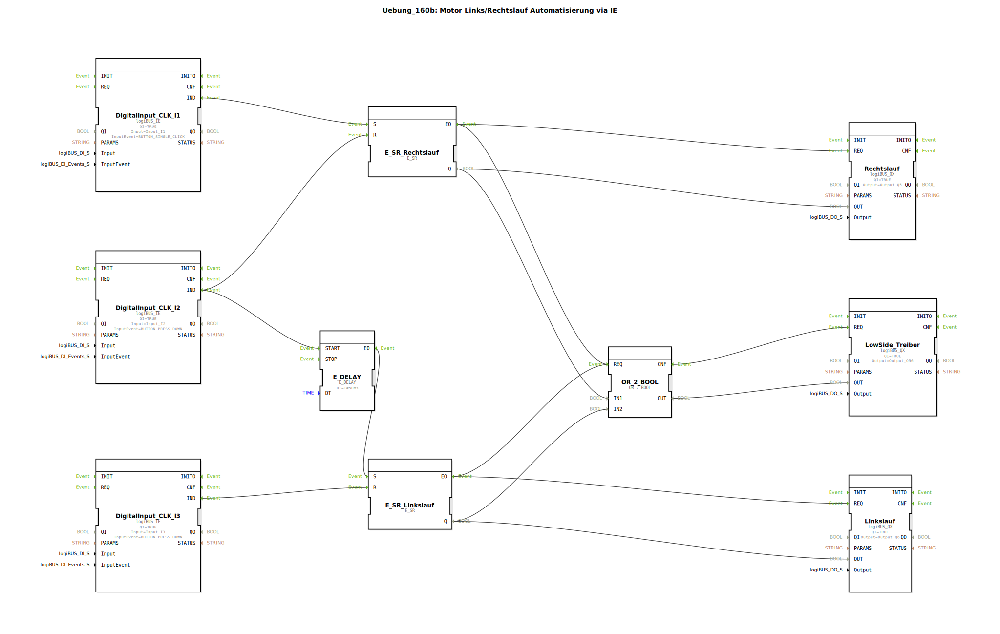

Hier ist die Dokumentation für die Übung 160b, basierend auf den bereitgestellten XML-Daten.

# Uebung_160b: Motor Links/Rechtslauf Automatisierung via IE

* * * * * * * * * *

## Einleitung
Diese Übung implementiert eine Steuerung für einen Motor mit Links- und Rechtslauf (Reversierbetrieb) unter Verwendung von logiBUS-Bausteinen für die Ein- und Ausgabe über Industrial Ethernet (IE). Die Schaltung verfügt über eine direkte Umschaltfunktion mit einer Sicherheitsverzögerung sowie eine Sammelanzeige für den Betriebszustand.

## Verwendete Funktionsbausteine (FBs)

In dieser Sub-Application werden verschiedene Standard-Bibliotheksbausteine sowie Hardware-Treiberbausteine verwendet, um die Logik abzubilden.

### Sub-Bausteine: Eingänge (Inputs)
Hier werden die Taster für die Steuerung eingelesen.

- **Typ**: `logiBUS::io::DI::logiBUS_IE`
- **Verwendete interne FBs**:
    - **DigitalInput_CLK_I1**: `logiBUS_IE`
        - Parameter: `Input` = `Input_I1`, `InputEvent` = `BUTTON_SINGLE_CLICK`
        - Beschreibung: Startet den ersten Ausgang (Q5). Reagiert auf einfachen Klick.
    - **DigitalInput_CLK_I2**: `logiBUS_IE`
        - Parameter: `Input` = `Input_I2`, `InputEvent` = `BUTTON_PRESS_DOWN`
        - Beschreibung: Stoppt Ausgang Q5 und initiiert den Start von Ausgang Q6. Reagiert auf das Herunterdrücken.
    - **DigitalInput_CLK_I3**: `logiBUS_IE`
        - Parameter: `Input` = `Input_I3`, `InputEvent` = `BUTTON_PRESS_DOWN`
        - Beschreibung: Stoppt den zweiten Ausgang (Q6). Reagiert auf das Herunterdrücken.

### Sub-Bausteine: Ausgänge (Outputs)
Diese Bausteine steuern die physischen Ausgänge an.

- **Typ**: `logiBUS::io::DQ::logiBUS_QX`
- **Verwendete interne FBs**:
    - **DigitalOutput_Q5**: `logiBUS_QX`
        - Parameter: `Output` = `Output_Q5`
        - Beschreibung: Steuert den Motor für Richtung A (z.B. Linkslauf).
    - **DigitalOutput_Q6**: `logiBUS_QX`
        - Parameter: `Output` = `Output_Q6`
        - Beschreibung: Steuert den Motor für Richtung B (z.B. Rechtslauf).
    - **DigitalOutput_Q56**: `logiBUS_QX`
        - Parameter: `Output` = `Output_Q56`
        - Beschreibung: Signalleuchte/Statusanzeige, aktiv wenn Q5 oder Q6 aktiv ist.

### Sub-Bausteine: Logik (Logic Control)
Die Kernlogik der Steuerung.

- **Typ**: `iec61499::events::E_SR` (Set/Reset Flip-Flop)
- **Verwendete interne FBs**:
    - **E_SR_A**: `E_SR`
        - Funktionsweise: Speichert den Zustand für Ausgang Q5. Wird durch I1 gesetzt und durch I2 zurückgesetzt.
    - **E_SR_B**: `E_SR`
        - Funktionsweise: Speichert den Zustand für Ausgang Q6. Wird verzögert durch I2 gesetzt und durch I3 zurückgesetzt.

- **Typ**: `iec61499::events::E_DELAY` (Verzögerung)
- **Verwendete interne FBs**:
    - **E_DELAY**: `E_DELAY`
        - Parameter: `DT` = `T#50ms`
        - Funktionsweise: Verzögert das Setzen von `E_SR_B` um 50 Millisekunden, nachdem I2 gedrückt wurde. Dies dient vermutlich als kurze Totzeit bei der Umschaltung der Drehrichtung.

- **Typ**: `iec61131::bitwiseOperators::OR_2_BOOL` (Logisches ODER)
- **Verwendete interne FBs**:
    - **OR_2_BOOL**: `OR_2_BOOL`
        - Funktionsweise: Verknüpft die Zustände von Q5 und Q6. Wenn einer der beiden Motorausgänge aktiv ist, wird der Ausgang Q56 aktiviert.

## Programmablauf und Verbindungen

Das Netzwerk realisiert eine Motorsteuerung mit folgenden Eigenschaften:

1.  **Start Richtung A (Q5):**
    *   Wird `Input_I1` (Klick) betätigt, sendet `DigitalInput_CLK_I1` ein Event an den Setz-Eingang (S) von `E_SR_A`.
    *   `E_SR_A` setzt seinen Ausgang Q auf TRUE, wodurch `DigitalOutput_Q5` aktiviert wird.

2.  **Umschaltung / Stopp A & Start B (Q6):**
    *   Wird `Input_I2` (Drücken) betätigt, geschehen zwei Dinge gleichzeitig:
        *   Ein Event geht an den Rücksetz-Eingang (R) von `E_SR_A`. Damit wird `DigitalOutput_Q5` sofort ausgeschaltet.
        *   Ein Event startet den Timer `E_DELAY`.
    *   Nach Ablauf von 50ms (`DT=T#50ms`) sendet `E_DELAY` ein Event an den Setz-Eingang (S) von `E_SR_B`.
    *   `E_SR_B` setzt seinen Ausgang Q auf TRUE, wodurch `DigitalOutput_Q6` aktiviert wird.
    *   *Hinweis:* I2 fungiert hier als Umschalter von A nach B mit einer kleinen Totzeit.

3.  **Stopp Richtung B (Q6):**
    *   Wird `Input_I3` (Drücken) betätigt, sendet `DigitalInput_CLK_I3` ein Event an den Rücksetz-Eingang (R) von `E_SR_B`.
    *   `DigitalOutput_Q6` wird ausgeschaltet.

4.  **Betriebsanzeige (Q56):**
    *   Die Datenausgänge (Q) von `E_SR_A` und `E_SR_B` sind mit den Eingängen des `OR_2_BOOL` Bausteins verbunden.
    *   Sobald einer der beiden SR-Speicher aktiv ist (Motor läuft links oder rechts), schaltet `OR_2_BOOL` den `DigitalOutput_Q56` ein.

**Lernziele:**
*   Verwendung von bistabilen Kippgliedern (SR-Latch) zur Zustandsspeicherung.
*   Implementierung einer Umschaltlogik mit Zeitverzögerung (E_DELAY) zur Vermeidung von abrupten Lastwechseln oder Kurzschlüssen.
*   Verarbeitung verschiedener Taster-Events (Single Click vs. Press Down).
*   Logische Verknüpfung von Zuständen (OR) zur Ansteuerung einer Sammelanzeige.

## Zusammenfassung
Die Übung `Uebung_160b` zeigt eine praxisnahe Implementierung einer Wendeschützschaltunglogik in IEC 61499. Durch die Kombination von SR-Latches und einem Delay-Timer wird sichergestellt, dass beim Umschalten von Links- auf Rechtslauf (ausgelöst durch Taster I2) der erste Ausgang abschaltet, bevor der zweite Ausgang nach 50ms zuschaltet. Taster I1 dient als Start für die erste Richtung, Taster I3 als Stopp für die zweite Richtung. Ausgang Q56 signalisiert, ob der Motor aktuell in Betrieb ist.