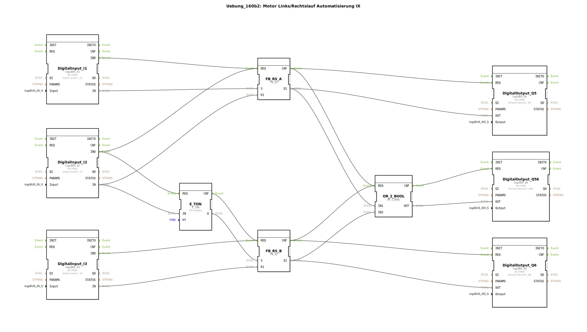

Hier ist die Dokumentation für die Übung `Uebung_160b2` im gewünschten Format.

# Uebung_160b2: Motor Links/Rechtslauf Automatisierung IX

*(Falls ein Bild der Netzwerksicht vorhanden ist, bitte hier einfügen)*

* * * * * * * * * *

## Einleitung

Die Übung **Uebung_160b2** implementiert eine Steuerung für einen Motor-Rechts/Linkslauf (Automatisierung IX). Der Fokus dieser Schaltung liegt auf der Umschaltung zwischen zwei Zuständen (Ausgänge Q5 und Q6) mit einer integrierten Totzeit (Verzögerung) beim Wechsel von Q5 auf Q6, gesteuert durch digitale Eingänge. Zusätzlich wird ein Sammelstatus ausgegeben.

## Verwendete Funktionsbausteine (FBs)

In dieser Sub-Application werden Standard-Bibliotheksbausteine verwendet, um die logischen Verknüpfungen zu realisieren.

*   **logiBUS_IX (DigitalInput_I1, _I2, _I3)**:
    *   Stellt die digitalen Eingänge der Hardware (I1, I2, I3) im Netzwerk bereit.
*   **logiBUS_QX (DigitalOutput_Q5, _Q6, _Q56)**:
    *   Steuert die digitalen Ausgänge der Hardware an.
*   **iec61131::bistableElements::FB_RS (FB_RS_A, FB_RS_B)**:
    *   Rücksetzdominante bistabile Kippglieder (RS-Flip-Flops). Sie speichern den Zustand "Ein" oder "Aus" für die Motoren.
*   **iec61131::bitwiseOperators::OR_2_BOOL (OR_2_BOOL)**:
    *   Eine logische ODER-Verknüpfung mit zwei Eingängen.
*   **iec61499::events::timers::E_TON (E_TON)**:
    *   Ein Einschaltverzögerungs-Timer (On-Delay Timer).

### Sub-Bausteine
*In dieser Übung werden keine benutzerdefinierten Sub-Bausteine verwendet, sondern direkte Instanzen von Standard-FBs verschaltet.*

## Programmablauf und Verbindungen

Die Schaltung realisiert eine verriegelte Steuerung zweier Ausgänge (z.B. Motor Links/Rechts) mit folgenden Eigenschaften:

1.  **Ansteuerung Ausgang Q5 (Erster Pfad):**
    *   Der Ausgang **Q5** wird über den Baustein **FB_RS_A** gesteuert.
    *   Betätigen von Eingang **I1** setzt (Set) den Baustein und aktiviert Q5.
    *   Betätigen von Eingang **I2** setzt den Baustein zurück (Reset) und deaktiviert Q5 sofort.

2.  **Umschaltung und Ansteuerung Ausgang Q6 (Zweiter Pfad):**
    *   Der Eingang **I2** hat eine Doppelfunktion: Er stoppt Q5 und startet den Vorgang für Q6.
    *   Das Signal von **I2** startet den Timer **E_TON**. Dieser ist auf **50ms** (`PT=50ms`) eingestellt.
    *   Nach Ablauf der 50ms setzt der Timer-Ausgang (`Q`) den Baustein **FB_RS_B**.
    *   Dadurch wird Ausgang **Q6** aktiv.
    *   Dies erzeugt eine kurze Totzeit zwischen dem Abschalten von Q5 und dem Einschalten von Q6, was bei Motorsteuerungen wichtig ist, um Kurzschlüsse oder mechanische Belastungen beim direkten Umschalten zu vermeiden.
    *   Betätigen von Eingang **I3** setzt **FB_RS_B** zurück und deaktiviert Q6.

3.  **Sammelanzeige Q56:**
    *   Der Baustein **OR_2_BOOL** überwacht die Ausgänge von FB_RS_A (Q5) und FB_RS_B (Q6).
    *   Der Ausgang **Q56** ist aktiv, sobald entweder Q5 **ODER** Q6 aktiv ist. Dies dient als "Betriebsanzeige".

**Zusammenfassende Logik:**
*   **I1** startet Q5.
*   **I2** stoppt Q5 und startet (verzögert um 50ms) Q6.
*   **I3** stoppt Q6.

## Zusammenfassung

Die Übung `Uebung_160b2` demonstriert eine fortgeschrittene Motorsteuerungsschaltung. Sie zeigt, wie man mithilfe von RS-Flip-Flops Zustände speichert und durch den Einsatz eines Timers (`E_TON`) eine automatische Umschaltverzögerung realisiert. Dies ist ein typisches Szenario in der Antriebstechnik, um beim Richtungswechsel die Hardware zu schützen. Die Ausgänge Q5 und Q6 repräsentieren die beiden Laufrichtungen, während Q56 den allgemeinen Betriebszustand signalisiert.