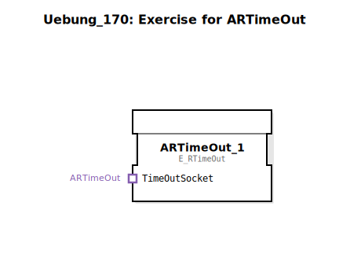

Hier ist die Dokumentation für die Übung `Uebung_170` basierend auf den bereitgestellten XML-Daten.

# Uebung_170: Exercise for ARTimeOut

* * * * * * * * * *

## Einleitung
Die `Uebung_170` ist eine Sub-Applikation, die sich mit der Handhabung von Zeitüberschreitungen (Timeouts) befasst. Sie dient als Übungsumgebung für den Funktionsbaustein `E_RTimeOut` (Event Resettable TimeOut), um dessen Verhalten innerhalb eines IEC 61499 Netzwerks zu testen oder zu demonstrieren.

## Verwendete Funktionsbausteine (FBs)

In dieser Übung wird eine Instanz eines Ereignis-Bausteins aus der Standardbibliothek verwendet.

### Enthaltene Bausteine:

- **ARTimeOut_1**
    - **Typ**: `iec61499::events::E_RTimeOut`
    - **Beschreibung**: Dieser Baustein stellt eine Timeout-Funktionalität für Ereignisse bereit. Er wird typischerweise verwendet, um zu überwachen, ob ein Ereignis innerhalb einer bestimmten Zeitspanne eintritt, und kann zurückgesetzt werden.
    - **Konfiguration**:
        - Position im Raster: x=-900, y=300.
        - Es sind im XML keine initialen Parameterwerte für diese Instanz definiert.

## Programmablauf und Verbindungen

Aktuell besteht das Netzwerk dieser Übung lediglich aus der Instanz `ARTimeOut_1`.

*   **Verbindungen**: Es sind in der vorliegenden Konfiguration keine Verbindungen (weder Daten noch Ereignisse) definiert. Der Baustein steht isoliert im Netzwerk.
*   **Funktionsweise der Übung**:
    *   Da keine Verbindungen vorhanden sind, ist diese Übung vermutlich dazu gedacht, den Baustein `E_RTimeOut` manuell im Debug-Modus zu testen oder als Ausgangspunkt für eine komplexere Schaltung zu dienen, bei der Verbindungen noch hinzugefügt werden müssen.
    *   Der Benutzer kann die Eingangsereignisse des Bausteins manuell triggern, um zu beobachten, wann und wie das Timeout-Ereignis ausgelöst wird.

## Zusammenfassung
Die `Uebung_170` stellt eine minimale Konfiguration bereit, die ausschließlich den Funktionsbaustein `E_RTimeOut` enthält. Sie dient als grundlegende Vorlage oder Testumgebung, um die Logik von rücksetzbaren Timeouts in der 4diac-IDE zu erlernen oder zu überprüfen.