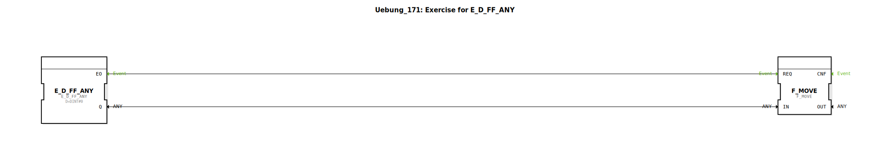

Hier ist die Dokumentationsseite für die Übung `Uebung_171` basierend auf den bereitgestellten Daten.

# Uebung_171: Exercise for E_D_FF_ANY

* * * * * * * * * *

## Einleitung

Diese Übung (`Uebung_171`) ist als Training für den Umgang mit dem Funktionsbaustein **E_MOVE** konzipiert. Sie demonstriert das Zusammenspiel zwischen IEC 61131-Funktionen zur Datenmanipulation und IEC 61499-Funktionsbausteinen zur ereignisgesteuerten Datenübertragung.

## Verwendete Funktionsbausteine (FBs)

Innerhalb dieser SubApp werden die folgenden Funktionsbausteine verwendet, um die Logik abzubilden:

### Sub-Bausteine: Enthaltene Komponenten

In dieser Übung werden spezifisch folgende Bausteine instanziiert:

*   **E_MOVE**
    *   **Typ**: `iec61499::events::E_MOVE`
    *   **Beschreibung**: Ein ereignisgesteuerter Baustein, der Daten von einem Eingang zu einem Ausgang bewegt, sobald ein Ereignis ausgelöst wird.
    *   **Verwendung in der Übung**: Dient als Empfänger des Datenwerts.

*   **F_MOVE**
    *   **Typ**: `iec61131::selection::F_MOVE`
    *   **Parameter**: `DataType` = `INT`
    *   **Beschreibung**: Eine Standard-IEC 61131 Funktion zur Zuweisung von Werten. In dieser Übung ist der Datentyp explizit auf `INT` (Integer) gesetzt.
    *   **Verwendung in der Übung**: Dient als Quelle oder Vorverarbeitung des Datenwerts, der an `E_MOVE` übergeben wird.

## Programmablauf und Verbindungen

Das Netzwerk zeigt eine einfache Verbindung zwischen einer Standard-Funktion und einem Event-Baustein, ist jedoch noch unvollständig (siehe TODO).

### Bestehende Datenverbindungen
*   **F_MOVE.OUT** $\rightarrow$ **E_MOVE.IN**: Das Ergebnis der Zuweisung/Bewegung aus dem Baustein `F_MOVE` wird direkt an den Dateneingang von `E_MOVE` geleitet.

### Hinweise zur Durchführung
Im Netzwerk befindet sich ein Kommentarbaustein mit dem Inhalt **"TODO"**. Dies deutet darauf hin, dass die Übung vom Anwender vervollständigt werden muss. Wahrscheinlich fehlen:
1.  Eingangswerte für `F_MOVE`, um einen Wert zu definieren.
2.  Eine Ereignis-Verbindung (Event Connection), um den `E_MOVE` Baustein zu triggern (Eingang `EI`), damit dieser den Datenwert übernimmt und weitergibt.

**Lernziele:**
*   Verständnis des Unterschieds zwischen reinen Datenfunktionen (`F_MOVE`) und ereignisgesteuerten Bausteinen (`E_MOVE`).
*   Korrekte Verdrahtung von Datentypen (hier `INT`).

## Zusammenfassung

Die `Uebung_171` stellt eine grundlegende Aufgabe dar, um die Datenübergabe in 4diac zu üben. Der Fokus liegt auf der korrekten Nutzung des `E_MOVE` Bausteins in Kombination mit vorangestellter IEC 61131 Logik (`F_MOVE`). Der Anwender muss die offenen Verbindungen im Sinne des "TODO"-Hinweises ergänzen, um die Funktionalität herzustellen.