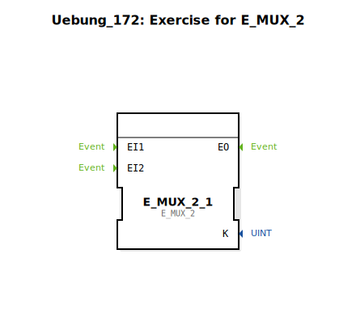

Hier ist die Dokumentation für die Übung `Uebung_172`, basierend auf den bereitgestellten Daten.

# Uebung_172: Exercise for E_MUX_2

* * * * * * * * * *

## Einleitung
Die Sub-Applikation **Uebung_172** ist eine Übungseinheit, die sich mit dem Funktionsbaustein `E_MUX_2` beschäftigt. Sie dient als Vorlage oder Ausgangspunkt, um die Funktionsweise des Event-Multiplexers (E_MUX) innerhalb der IEC 61499 Norm zu erlernen und zu implementieren.

## Verwendete Funktionsbausteine (FBs)

In dieser Übung wird der Standard-Baustein aus der `iec61499::events` Bibliothek verwendet.

### Sub-Bausteine: Uebung_172
Diese Sub-Applikation definiert den Rahmen der Übung.

- **Typ**: SubAppType
- **Verwendete interne FBs**:
    - **E_MUX_2_1**: `iec61499::events::E_MUX_2`
        - **Beschreibung**: Dies ist eine Instanz des `E_MUX_2` Bausteins (Event Multiplexer für 2 Eingänge).
        - **Parameter**: Keine Parameter initial gesetzt.
        - **Koordinaten**: x=-3000, y=-1000

## Programmablauf und Verbindungen

Aktuell stellt die Übung ein Gerüst dar, das vom Anwender vervollständigt werden muss.

*   **Status**: Die Sub-Applikation enthält eine Instanz des `E_MUX_2`, jedoch noch keine Verbindungen (Event- oder Datenflüsse).
*   **Hinweise**: Im Netzwerk befindet sich ein Kommentar-Feld mit dem Inhalt **"TODO"** (bei x=-1900, y=-400). Dies signalisiert, dass die Logik, Eingänge und Ausgänge noch verdrahtet werden müssen.
*   **Ziel der Übung**: Das Ziel ist vermutlich, zwei verschiedene Event-Quellen an den `E_MUX_2` anzuschließen und das resultierende Ausgangs-Event weiterzuverarbeiten, um das Prinzip der Ereignis-Zusammenführung (Multiplexing) zu verstehen.

## Zusammenfassung
Die `Uebung_172` ist eine vorbereitete Arbeitsumgebung für die Auseinandersetzung mit dem `E_MUX_2` Funktionsbaustein. Sie enthält die notwendige Instanz des Bausteins und einen Platzhalter-Kommentar, überlässt die konkrete Implementierung der Event-Logik jedoch dem Lernenden.