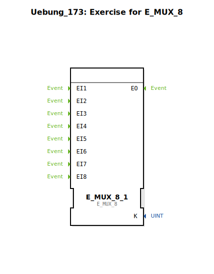

Hier ist die Dokumentationsseite für die Übung `Uebung_173` basierend auf den bereitgestellten Daten.

# Uebung_173: Exercise for E_MUX_8

* * * * * * * * * *

## Einleitung
Die Sub-Applikation **Uebung_173** dient als Übungsumgebung für den Umgang mit dem Funktionsbaustein `E_MUX_8`. Das Ziel dieser Übung ist es, das Konzept des Ereignis-Multiplexings (Zusammenführen mehrerer Ereignispfade) innerhalb der IEC 61499 Norm zu verstehen und anzuwenden.

Der bereitgestellte Arbeitsbereich enthält einen einzelnen Baustein und einen Platzhalter-Kommentar, was darauf hindeutet, dass der Nutzer die Logik vervollständigen muss.

## Verwendete Funktionsbausteine (FBs)

In diesem Netzwerk wird primär der folgende Standard-Baustein verwendet:

### E_MUX_8_1
- **Typ**: `iec61499::events::E_MUX_8`
- **Beschreibung**: Dies ist ein Ereignis-Multiplexer mit 8 Eingängen.
- **Schnittstellen**:
    - **Ereigniseingänge (EI1 bis EI8)**: Trigger-Eingänge für verschiedene Ereignisquellen.
    - **Ereignisausgang (EO)**: Dieser Ausgang feuert, sobald einer der Eingänge `EI1` bis `EI8` ein Ereignis empfängt.
- **Funktionsweise**: Der Baustein fungiert wie eine ODER-Verknüpfung für Ereignisse. Er leitet jedes eingehende Event an den Ausgang weiter, unabhängig davon, an welchem Eingang es auftritt.

## Programmablauf und Verbindungen

Aktuell befindet sich die Übung in einem initialen Zustand ("TODO").

### 🌐 Netzwerk-Status
- **Vorhandene Instanzen**: Eine Instanz des Multiplexers (`E_MUX_8_1`) ist im Netzwerk platziert (Koordinaten: -3000, -1000).
- **Verbindungen**: Es sind **keine** Verbindungen im XML definiert. Der Baustein steht isoliert.
- **Kommentare**: Ein großer Kommentarblock mit dem Inhalt "TODO" markiert den Bereich, in dem die Implementierung erfolgen soll.

### Durchführung der Übung
1.  **Ziel**: Der Nutzer soll vermutlich Ereignisquellen (z.B. von anderen Bausteinen oder Eingängen der SubApp) mit den Eingängen des `E_MUX_8` verbinden.
2.  **Logik**: Es soll realisiert werden, dass verschiedene Ereignisse auf einen einzigen Ereignispfad (den Ausgang des Mux) zusammengeführt werden.
3.  **Voraussetzungen**: Verständnis darüber, wie Events in 4diac verbunden werden und wie die Abarbeitungsreihenfolge (Execution Order) funktioniert.

## Zusammenfassung
Die `Uebung_173` ist eine grundlegende Vorlage zur Erlernung der Ereignissteuerung mittels `E_MUX_8`. Sie stellt den notwendigen Baustein bereit, überlässt aber die Verschaltung und Integration in eine größere Logik dem Anwender als Teil der Lernaufgabe.