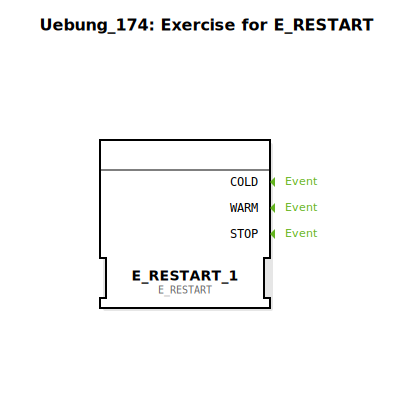

Hier ist die Dokumentation für die Übung `Uebung_174`, basierend auf den bereitgestellten XML-Daten.

# Uebung_174: Exercise for E_RESTART

* * * * * * * * * *

## Einleitung
Die **Uebung_174** ist eine Sub-Application, die sich mit dem Initialisierungsverhalten von Steuerungen in IEC 61499 beschäftigt. Spezifisch geht es um den Umgang mit dem `E_RESTART` Funktionsbaustein. Die Übung stellt ein Grundgerüst dar, in dem die Logik für Kalt- und Warmstarts implementiert werden soll.

## Verwendete Funktionsbausteine (FBs)

In dieser Übung wird primär ein spezifischer Event-Baustein aus der Standardbibliothek verwendet.

### Enthaltene Bausteine:

*   **E_RESTART_1**
    *   **Typ**: `iec61499::events::E_RESTART`
    *   **Beschreibung**: Dieser Funktionsbaustein stellt Ereignisse zur Verfügung, die ausgelöst werden, wenn die Ressource, auf der die Applikation läuft, gestartet wird.
        *   **Ereignisausgang COLD**: Wird ausgelöst bei einem Kaltstart (erstmaliges Starten oder Reset).
        *   **Ereignisausgang WARM**: Wird ausgelöst bei einem Warmstart (Wiederaufnahme des Betriebs, falls unterstützt).
    *   **Funktionsweise**: Er dient als Trigger für Initialisierungsroutinen innerhalb der Applikation.

## Programmablauf und Verbindungen

Aktuell stellt diese Übung ein leeres Netzwerk mit einer Aufgabenstellung dar.

*   **Aktueller Zustand**:
    *   Der Baustein `E_RESTART_1` ist im Netzwerk platziert.
    *   Es existieren noch keine Verbindungen zu anderen Bausteinen.
    *   Ein Kommentarfeld mit dem Inhalt **"TODO"** weist auf den zu bearbeitenden Bereich hin.

*   **Lernziele**:
    *   Verständnis des Unterschieds zwischen `COLD` und `WARM` Start-Events.
    *   Nutzung des `E_RESTART` Bausteins zur Initialisierung von Variablen oder Zuständen beim Start der Steuerung.

*   **Vorgehensweise**:
    1.  Die Übung wird als SubApp geöffnet.
    2.  An die Ausgänge des `E_RESTART_1` Bausteins sollen Logik-Ketten angeschlossen werden, die definieren, was beim Start der Applikation passieren soll (z.B. Setzen von Standardwerten).

## Zusammenfassung
Die `Uebung_174` ist eine Basisübung zur Implementierung von Start-up-Routinen. Sie bietet den `E_RESTART` Baustein an und fordert den Anwender durch einen "TODO"-Kommentar dazu auf, die entsprechende Initialisierungslogik für den Kalt- und Warmstart der Steuerung zu entwickeln.