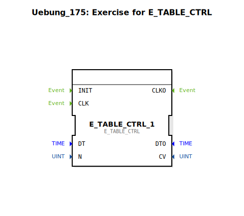

Hier ist die Dokumentationsseite für die Übung `Uebung_175`, basierend auf den bereitgestellten Daten.

```markdown
# Uebung_175: Exercise for E_TABLE_CTRL




* * * * * * * * * *

## Einleitung
Die Übung **Uebung_175** ist eine Vorlage zur Einarbeitung in die Nutzung von Tabellensteuerungen innerhalb der IEC 61499 Architektur. Der Fokus liegt speziell auf dem Funktionsbaustein `E_TABLE_CTRL` (Event Table Control). Die Übung stellt ein Grundgerüst bereit, das durch den Anwender vervollständigt werden muss.

## Verwendete Funktionsbausteine (FBs)

In dieser Sub-Applikation wird primär ein Instanz eines Standard-Bibliotheksbausteins verwendet.

### Sub-Bausteine: E_TABLE_CTRL_1
- **Typ**: `iec61499::events::E_TABLE_CTRL`
- **Verwendete interne FBs**:
    - Dieser Baustein ist eine Instanz aus der Standardbibliothek (`iec61499`).
    - **Parameter**:
        - Aktuell sind keine Parameter im Netzwerk vordefiniert.
    - **Funktionsweise**:
        - Der `E_TABLE_CTRL` Baustein dient üblicherweise dazu, ereignisgesteuerte Abläufe basierend auf einer Zustandstabelle oder einer definierten Sequenz zu steuern. Er schaltet Ausgänge basierend auf Eingangszuständen und einer hinterlegten Logik (oft State-Machine ähnlich).

## Programmablauf und Verbindungen

Das Netzwerk dieser Übung ist als **Aufgabe (TODO)** konzipiert.

*   **Status des Netzwerks**:
    *   Der Baustein `E_TABLE_CTRL_1` wurde im Netzwerk bei den Koordinaten `x=-3000, y=-1000` platziert.
    *   Es existieren aktuell **keine Verbindungen** (weder Daten noch Ereignisse) zwischen Bausteinen oder Schnittstellen.
    *   Ein großer Kommentarblock mit dem Inhalt **"TODO"** (bei `x=-3100, y=-100`) weist darauf hin, dass die eigentliche Implementierung der Steuerungslogik noch erfolgen muss.

*   **Lernziele**:
    *   Verständnis der Schnittstellen des `E_TABLE_CTRL`.
    *   Verschaltung von Ereignissen und Daten zur Realisierung einer Sequenzsteuerung.

*   **Vorgehensweise**:
    1.  Analysieren Sie die benötigten Ein- und Ausgänge des `E_TABLE_CTRL`.
    2.  Verbinden Sie die notwendigen Ereignis- und Datenleitungen gemäß der Aufgabenstellung (die hier implizit durch das "TODO" gegeben ist).
    3.  Konfigurieren Sie die Parameter des Bausteins, falls notwendig.

## Zusammenfassung
Die `Uebung_175` ist eine leere Übungsumgebung ("Skeleton"), die lediglich den Baustein `E_TABLE_CTRL` bereitstellt. Ziel der Übung ist es, die Funktionalität dieses Bausteins durch eigenständiges Erstellen der Verbindungen und Logik zu erlernen.
```