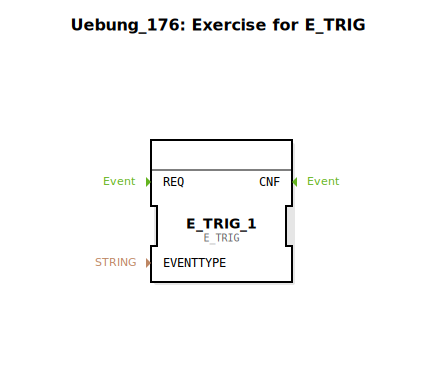

Hier ist die Dokumentation für die Übung basierend auf den bereitgestellten XML-Daten:

# Uebung_176: Exercise for E_TRIG

![Bild der Übung, falls vorhanden]

* * * * * * * * * *
## Einleitung
Die `Uebung_176` ist eine Übungseinheit, die sich mit der Ereigniserzeugung bei steigenden Flanken beschäftigt. Der Fokus liegt auf dem Verständnis und der Anwendung des `E_TRIG` (Edge Trigger) Bausteins innerhalb einer IEC 61499 Anwendung. Die Übung stellt ein Grundgerüst bereit, welches durch den Benutzer vervollständigt werden muss.

## Verwendete Funktionsbausteine (FBs)

In dieser Sub-Application wird der folgende Funktionsbaustein verwendet, um die Logik zu implementieren:

### Sub-Bausteine: E_TRIG_1
- **Typ**: `iec61499::events::E_TRIG`
- **Verwendete interne FBs**:
    - **Bausteinname**: E_TRIG_1
        - **Typ**: Edge Trigger (Steigende Flanke)
        - **Parameter**: Keine statischen Parameter im XML definiert.
        - **Ereignisausgang/-eingang**:
            - `EI` (Event Input): Muss getriggert werden, um den Status von `QI` zu prüfen.
            - `EO` (Event Output): Feuert, wenn eine steigende Flanke an `QI` erkannt wurde.
        - **Datenausgang/-eingang**:
            - `QI` (Input): Der boolesche Eingang, der auf eine Änderung von FALSE auf TRUE überwacht wird.
- **Funktionsweise**:
    Der `E_TRIG` Baustein dient dazu, Ereignisse nur dann weiterzuleiten oder zu generieren, wenn sich das boolesche Eingangssignal (`QI`) von `FALSE` auf `TRUE` ändert (steigende Flanke) und gleichzeitig ein Ereignis am Eingang `EI` anliegt.

## Programmablauf und Verbindungen

Diese Übung ist als Vorlage konzipiert. Aktuell sind im Netzwerk keine Verbindungen definiert, jedoch ist der zentrale Baustein `E_TRIG_1` platziert.

### Lernziele und Aufgaben:
*   **Verständnis der Flankenerkennung**: Lernen, wie Signale auf Zustandsänderungen überwacht werden.
*   **TODO**: Im Netzwerk befindet sich ein Kommentarbaustein mit dem Inhalt "TODO". Dies weist darauf hin, dass der Lernende die notwendigen Ereignis- und Datenverbindungen herstellen muss, um die Funktionalität zu gewährleisten.

### Start der Übung:
1.  Öffnen Sie die `Uebung_176` in der 4diac IDE.
2.  Beachten Sie den platzierten `E_TRIG_1` Baustein an den Koordinaten (-3000, -1000).
3.  Vervollständigen Sie die Verschaltung gemäß der Aufgabenstellung (Verbindung von Eingangsevents und booleschen Signalen).

## Zusammenfassung
Die `Uebung_176` bietet eine kompakte Umgebung zum Erlernen des `E_TRIG` Bausteins. Durch das manuelle Vervollständigen der Verbindungen wird das Verständnis für ereignisgesteuerte Flankenerkennung in Steuerungssystemen vertieft.