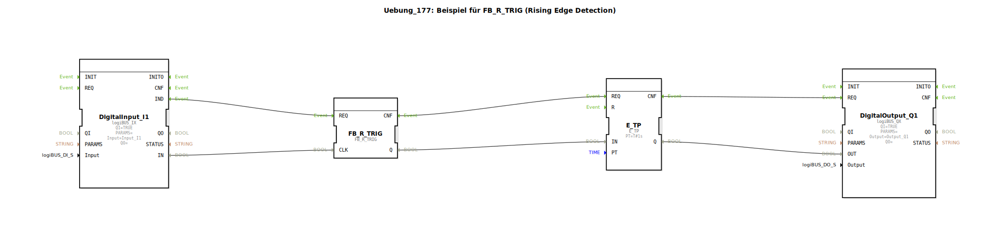

Hier ist die Dokumentation für die Übung 177, basierend auf den bereitgestellten Daten.

# Uebung_177: Beispiel für FB_R_TRIG (Rising Edge Detection)

* * * * * * * * * *

## Einleitung
Die **Uebung_177** demonstriert die Verwendung des `FB_R_TRIG` Funktionsbausteins zur Erkennung einer steigenden Flanke (Rising Edge Detection). Ziel der Übung ist es, ein Eingangssignal so zu verarbeiten, dass nur der Moment des Einschaltens (Wechsel von FALSE auf TRUE) eine Aktion auslöst. Dieses kurzzeitige Signal wird anschließend genutzt, um einen Timer zu starten, der einen Ausgang für eine definierte Zeit aktiviert.

## Verwendete Funktionsbausteine (FBs)

In dieser Übung werden folgende Funktionsbausteine innerhalb des Netzwerks verwendet:

*   **DigitalInput_I1** (`logiBUS::io::DI::logiBUS_IX`)
    *   Dient als Schnittstelle zum physischen Eingang `Input_I1`. Er liefert das Eingangssignal für die Flankenerkennung.
*   **FB_R_TRIG** (`iec61131::edgeDetection::FB_R_TRIG`)
    *   Dies ist der Kernbaustein der Übung. Er überwacht den Eingang `CLK`. Wenn `CLK` von FALSE auf TRUE wechselt (steigende Flanke), wird der Ausgang `Q` für genau einen Zyklus auf TRUE gesetzt.
*   **E_TP** (`iec61499::events::timers::E_TP`)
    *   Ein Impuls-Timer (Pulse Timer).
    *   **Parameter**: `PT` ist auf `T#1s` (1 Sekunde) eingestellt.
    *   Erzeugt einen Impuls von 1 Sekunde Länge, sobald der Eingang `IN` aktiviert wird.
*   **DigitalOutput_Q1** (`logiBUS::io::DQ::logiBUS_QX`)
    *   Dient als Schnittstelle zum physischen Ausgang `Output_Q1`. Er schaltet den Ausgang basierend auf dem Signal des Timers.

## Programmablauf und Verbindungen

Der Ablauf der Steuerung gestaltet sich wie folgt:

1.  **Signalerfassung**: Der Baustein `DigitalInput_I1` liest den Zustand des physikalischen Eingangs (z.B. ein Taster). Das Ereignis `IND` und der Datenwert `IN` werden an den Flankenerkennungs-Baustein weitergeleitet.
2.  **Flankenerkennung**:
    *   Der Baustein `FB_R_TRIG` empfängt das Signal am Eingang `CLK`.
    *   Sobald eine Änderung von 0 auf 1 (Taster wird gedrückt) erkannt wird, setzt `FB_R_TRIG` seinen Ausgang `Q` kurzzeitig auf TRUE.
    *   Wird der Taster gehalten oder losgelassen (fallende Flanke), bleibt der Ausgang `Q` auf FALSE.
3.  **Zeitsteuerung**:
    *   Das kurzzeitige Signal von `FB_R_TRIG.Q` triggert den Eingang `IN` des Timers `E_TP`.
    *   Der Timer `E_TP` startet daraufhin einen Impuls. Sein Ausgang `Q` wird für die Dauer von 1 Sekunde (`PT=T#1s`) auf TRUE gesetzt, unabhängig davon, ob das Eingangssignal am Taster noch anliegt oder nicht.
4.  **Ausgabe**:
    *   Der Zustand des Timers (`E_TP.Q`) wird an `DigitalOutput_Q1.OUT` übergeben.
    *   Dies bewirkt, dass der physikalische Ausgang `Output_Q1` (z.B. eine Lampe) für genau 1 Sekunde leuchtet, jedes Mal wenn der Eingangstaster neu gedrückt wird.

**Verbindungsübersicht:**
*   `DigitalInput_I1.IND` -> `FB_R_TRIG.REQ`
*   `DigitalInput_I1.IN` -> `FB_R_TRIG.CLK`
*   `FB_R_TRIG.CNF` -> `E_TP.REQ`
*   `FB_R_TRIG.Q` -> `E_TP.IN`
*   `E_TP.CNF` -> `DigitalOutput_Q1.REQ`
*   `E_TP.Q` -> `DigitalOutput_Q1.OUT`

## Zusammenfassung
Diese Übung zeigt eine klassische Anwendung in der Automatisierungstechnik: Das Entkoppeln eines statischen Eingangssignals (Schalterzustand) von der Ausgabelogik durch Flankenerkennung. Durch die Kombination von `FB_R_TRIG` und `E_TP` wird sichergestellt, dass der Ausgang `Q1` bei jedem Drücken des Tasters `I1` exakt für eine Sekunde aktiv ist, selbst wenn der Taster länger gedrückt gehalten wird.