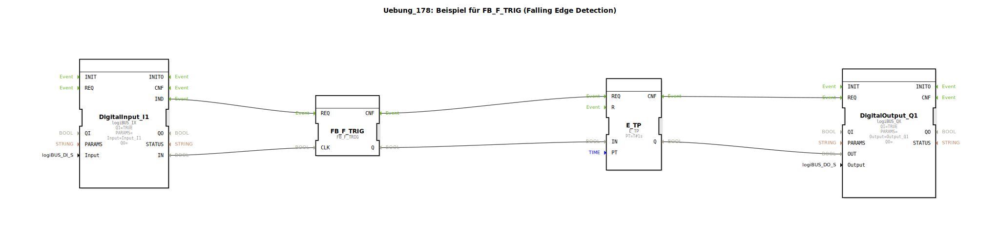

Hier ist die Dokumentation für die Übung 178, basierend auf den bereitgestellten XML-Daten.

# Uebung_178: Beispiel für FB_F_TRIG (Falling Edge Detection)

* * * * * * * * * *

## Einleitung
Die **Uebung_178** beschäftigt sich mit der Erkennung von fallenden Flanken in der Signalverarbeitung. Ziel ist es, ein Ereignis genau dann auszulösen, wenn ein Eingangssignal von `TRUE` (High) auf `FALSE` (Low) wechselt. Zusätzlich wird dieses Ereignis genutzt, um einen zeitlich begrenzten Impuls zu generieren.

## Verwendete Funktionsbausteine (FBs)

In dieser Sub-Application werden folgende Funktionsbausteine verwendet:

*   **DigitalInput_I1** (`logiBUS::io::DI::logiBUS_IX`):
    *   Dient zum Einlesen des digitalen Signals.
    *   Konfiguriert auf den Hardware-Eingang `Input_I1`.
*   **FB_F_TRIG** (`iec61131::edgeDetection::FB_F_TRIG`):
    *   Baustein zur Erkennung einer fallenden Flanke (Falling Edge Trigger).
*   **E_TP** (`iec61499::events::timers::E_TP`):
    *   Ein Impulsgeber (Pulse Timer).
    *   Konfiguriert mit einer Zeitdauer (`PT`) von 1 Sekunde (`T#1s`).
*   **DigitalOutput_Q1** (`logiBUS::io::DQ::logiBUS_QX`):
    *   Dient zur Ausgabe des digitalen Signals.
    *   Konfiguriert auf den Hardware-Ausgang `Output_Q1`.

## Programmablauf und Verbindungen

Der Programmablauf dieser Übung gestaltet sich wie folgt:

1.  **Signaleingang:**
    Der Baustein `DigitalInput_I1` liest den Status des Hardware-Eingangs `Input_I1`. Sobald ein Signal anliegt (z.B. ein Taster gedrückt wird) oder sich ändert, wird dies über das Event `IND` und den Datenanschluss `IN` weitergegeben.

2.  **Flankenerkennung:**
    Das Eingangssignal (`IN` von `DigitalInput_I1`) ist mit dem Takteingang (`CLK`) des `FB_F_TRIG` verbunden.
    *   Der `FB_F_TRIG` überwacht dieses Signal.
    *   Erkennt der Baustein einen Wechsel von **High auf Low** (z.B. Loslassen eines Tasters), schaltet der Ausgang `Q` kurzzeitig auf `TRUE`.

3.  **Zeitsteuerung (Impuls):**
    Das Ausgangssignal `Q` des Flankentriggers ist mit dem Eingang `IN` des Timers `E_TP` verbunden.
    *   Sobald die fallende Flanke erkannt wurde, startet der Timer `E_TP`.
    *   Der Timer generiert einen Impuls mit der Dauer von **1 Sekunde** (definiert durch `PT = T#1s`).

4.  **Signalausgang:**
    Der Ausgang `Q` des Timers steuert den Eingang `OUT` des `DigitalOutput_Q1`.
    *   Dies bewirkt, dass der Hardware-Ausgang `Output_Q1` (z.B. eine Lampe) für genau 1 Sekunde aktiviert wird, nachdem das Eingangssignal abgefallen ist.

**Zusammenfassender Datenfluss:**
`DigitalInput_I1.IN` -> `FB_F_TRIG.CLK` -> `FB_F_TRIG.Q` -> `E_TP.IN` -> `E_TP.Q` -> `DigitalOutput_Q1.OUT`

**Zusammenfassender Ereignisfluss:**
`DigitalInput_I1.IND` -> `FB_F_TRIG.REQ` -> `FB_F_TRIG.CNF` -> `E_TP.REQ` -> `E_TP.CNF` -> `DigitalOutput_Q1.REQ`

## Zusammenfassung
Die Uebung_178 demonstriert die klassische Anwendung einer "Nachlaufsteuerung" oder Abschaltverzögerung basierend auf einem negativen Signalwechsel. Der Benutzer lernt hierbei die Kombination aus digitaler Signalerfassung, logischer Flankenauswertung mittels `FB_F_TRIG` und zeitgesteuerter Ausgabe mittels `E_TP`. Ein praktisches Beispiel wäre ein Licht, das für eine Sekunde aufleuchtet, sobald ein Taster *losgelassen* wird.