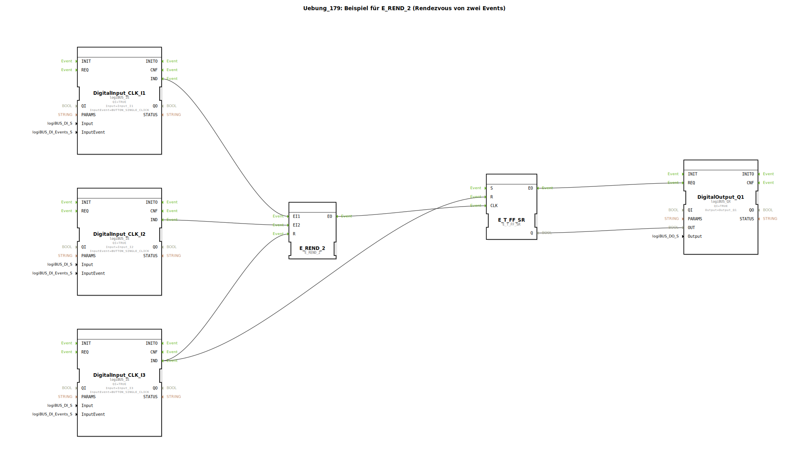

Hier ist die Dokumentation für die Übung 179, basierend auf den bereitgestellten Informationen.

# Uebung_179: Beispiel für E_REND_2 (Rendezvous von zwei Events)

* * * * * * * * * *

## Einleitung

Diese Übung demonstriert die Verwendung des Funktionsbausteins **E_REND_2** (Event Rendezvous). Ziel ist es, das Konzept der Event-Synchronisation zu verstehen. Ein Rendezvous-Baustein sorgt dafür, dass ein ausgehendes Ereignis erst dann ausgelöst wird, wenn an beiden Eingängen ein Ereignis eingetroffen ist. Dies wird oft verwendet, um zwei parallele Prozesse zu synchronisieren, bevor ein nachfolgender Schritt ausgeführt wird.

## Verwendete Funktionsbausteine (FBs)

In dieser Sub-Applikation werden folgende Funktionsbausteine aus der Standard- und logiBUS-Bibliothek verwendet:

*   **logiBUS::io::DI::logiBUS_IE (3x)**
    *   Verwendet als: `DigitalInput_CLK_I1`, `DigitalInput_CLK_I2`, `DigitalInput_CLK_I3`
    *   Funktion: Stellt die physikalischen Eingänge (Taster) I1, I2 und I3 bereit. Konfiguriert auf das Event `BUTTON_SINGLE_CLICK`.

*   **iec61499::events::E_REND_2**
    *   Verwendet als: `E_REND_2`
    *   Funktion: Ein Event-Synchronisierungs-Baustein. Er wartet auf Ereignisse an den Eingängen `EI1` und `EI2`. Erst wenn beide Ereignisse eingetroffen sind (unabhängig von der Reihenfolge), wird das Ausgangsereignis `EO` gefeuert. Über den Eingang `R` kann der interne Status zurückgesetzt werden.

*   **iec61499::events::E_T_FF_SR**
    *   Verwendet als: `E_T_FF_SR`
    *   Funktion: Ein Toggle-Flip-Flop (T-Flip-Flop) mit Set- und Reset-Eingängen. Bei jedem Ereignis am Eingang `CLK` wechselt der Zustand des Ausgangs `Q` (von TRUE auf FALSE oder umgekehrt).

*   **logiBUS::io::DQ::logiBUS_QX**
    *   Verwendet als: `DigitalOutput_Q1`
    *   Funktion: Steuert den physikalischen Ausgang Q1 an, um den aktuellen Status anzuzeigen.

## Programmablauf und Verbindungen

Der Ablauf der Übung gestaltet sich wie folgt:

1.  **Eingänge (Rendezvous):**
    *   Der Taster **I1** (`DigitalInput_CLK_I1`) ist mit dem ersten Ereigniseingang `EI1` des `E_REND_2` Bausteins verbunden.
    *   Der Taster **I2** (`DigitalInput_CLK_I2`) ist mit dem zweiten Ereigniseingang `EI2` des `E_REND_2` Bausteins verbunden.
    *   Das Drücken von nur einem dieser beiden Taster bewirkt zunächst keine Änderung am Ausgang. Der Baustein "merkt" sich das Ereignis.
    *   Erst wenn **beide** Taster (I1 und I2) betätigt wurden (das "Rendezvous" der Events ist komplett), löst der `E_REND_2` das Ausgangsevent `EO` aus.

2.  **Verarbeitung (Toggle):**
    *   Das Ausgangsevent `EO` des `E_REND_2` ist mit dem Takteingang `CLK` des `E_T_FF_SR` verbunden.
    *   Sobald das Rendezvous stattgefunden hat, wird das Flip-Flop getriggert und schaltet den Ausgang Q1 um (Licht an oder aus).

3.  **Reset-Funktion:**
    *   Der Taster **I3** (`DigitalInput_CLK_I3`) fungiert als zentraler Reset.
    *   Er ist mit dem Reset-Eingang `R` des `E_REND_2` verbunden. Dies löscht eventuell bereits gespeicherte Einzel-Events (z.B. wenn I1 gedrückt wurde, aber I2 noch fehlt).
    *   Gleichzeitig ist I3 mit dem Reset-Eingang `R` des Flip-Flops `E_T_FF_SR` verbunden, wodurch der Ausgang Q1 sofort ausgeschaltet wird (`FALSE`).

4.  **Ausgabe:**
    *   Der Datenstatus `Q` des Flip-Flops wird an den `DigitalOutput_Q1` übertragen und steuert die Hardware-LED/Lampe an.

## Zusammenfassung

Die Übung `Uebung_179` zeigt anschaulich, wie man zwei unabhängige Ereignisströme synchronisiert. Die Lampe Q1 schaltet ihren Zustand nur um, wenn sowohl Taster I1 als auch Taster I2 betätigt wurden. Mit Taster I3 kann der Prozess jederzeit abgebrochen und der Ausgang zurückgesetzt werden. Dies ist ein grundlegendes Muster für Steuerungen, bei denen zwei Bedingungen (Events) erfüllt sein müssen, um fortzufahren.