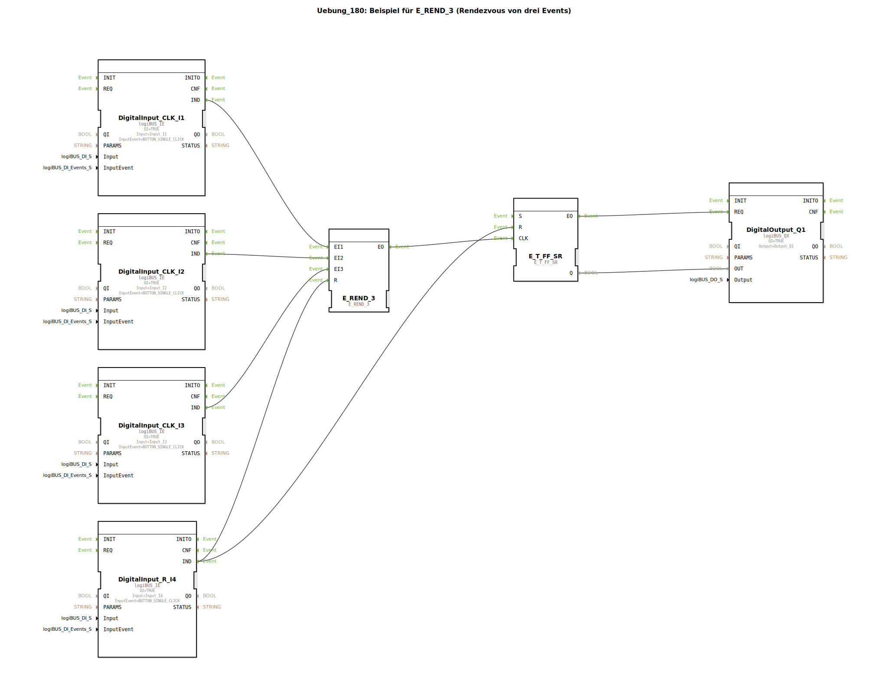

Hier ist die Dokumentation für die Übung **Uebung_180**, basierend auf den bereitgestellten XML-Daten.

# Uebung_180: Beispiel für E_REND_3 (Rendezvous von drei Events)

* * * * * * * * * *

## Einleitung

Diese Übung demonstriert die Synchronisation von Ereignissen mittels eines Rendezvous-Bausteins. Ziel ist es, eine Aktion (das Umschalten eines Ausgangs) erst dann auszuführen, wenn drei separate Eingangsereignisse eingetreten sind. Dies veranschaulicht das Prinzip der Ereignis-Synchronisation in IEC 61499 Steuerungssystemen.

## Verwendete Funktionsbausteine (FBs)

In dieser SubApplikation werden verschiedene Funktionsbausteine kombiniert, um die Logik abzubilden. Da es sich bei `Uebung_180` um einen SubAppType handelt, werden hier die darin enthaltenen internen Bausteine und ihre Konfiguration beschrieben.

### Interne Bausteine

#### `DigitalInput_CLK_I1`, `DigitalInput_CLK_I2`, `DigitalInput_CLK_I3`
- **Typ**: `logiBUS::io::DI::logiBUS_IE`
- **Funktion**: Stellen die drei notwendigen Eingangssignale bereit, die synchronisiert werden sollen.
- **Konfiguration**:
    - `Input` = `Input_I1` / `Input_I2` / `Input_I3`
    - `InputEvent` = `BUTTON_SINGLE_CLICK`
    - `QI` = `TRUE`

#### `DigitalInput_R_I4`
- **Typ**: `logiBUS::io::DI::logiBUS_IE`
- **Funktion**: Dient als zentraler Reset-Eingang für die Schaltung.
- **Konfiguration**:
    - `Input` = `Input_I4`
    - `InputEvent` = `BUTTON_SINGLE_CLICK`
    - `QI` = `TRUE`

#### `E_REND_3`
- **Typ**: `iec61499::events::E_REND_3`
- **Funktion**: Ein "Rendezvous"-Baustein für drei Ereignisse. Er wartet, bis an allen drei Eingängen (`EI1`, `EI2`, `EI3`) jeweils ein Ereignis eingetreten ist. Erst wenn alle drei Ereignisse registriert wurden (die Reihenfolge ist dabei irrelevant), feuert der Ausgang `EO`.
- **Anschlüsse**:
    - Eingänge `EI1`, `EI2`, `EI3` verbunden mit den digitalen Eingängen I1, I2 und I3.
    - Eingang `R` verbunden mit Reset-Eingang I4.

#### `E_T_FF_SR`
- **Typ**: `iec61499::events::E_T_FF_SR`
- **Funktion**: Ein Toggle-Flip-Flop (T-FlipFlop) mit Set- und Reset-Eingängen. Bei jedem Ereignis am `CLK`-Eingang wechselt der Status des Ausgangs `Q`.
- **Anschlüsse**:
    - `CLK` verbunden mit dem Ausgang des Rendezvous-Bausteins.
    - `R` (Reset) verbunden mit dem Reset-Eingang I4.

#### `DigitalOutput_Q1`
- **Typ**: `logiBUS::io::DQ::logiBUS_QX`
- **Funktion**: Steuert den physischen Ausgang basierend auf dem Status des Flip-Flops.
- **Konfiguration**:
    - `Output` = `Output_Q1`
    - `QI` = `TRUE`

## Programmablauf und Verbindungen

Die Schaltung realisiert eine logische UND-Verknüpfung auf zeitlicher Ebene (Synchronisation):

1.  **Eingabeerfassung**: Die drei Eingangsbausteine `DigitalInput_CLK_I1`, `_I2` und `_I3` senden bei Betätigung (Single Click) ein `IND`-Event.
2.  **Rendezvous (Synchronisation)**: Diese drei Events werden an den Baustein `E_REND_3` geleitet.
    *   Der Baustein speichert intern, welche Eingänge bereits betätigt wurden.
    *   Erst wenn **alle drei** Eingänge (I1, I2 und I3) mindestens einmal ein Signal gesendet haben, wird das Ausgangsevent `EO` des `E_REND_3` ausgelöst.
3.  **Verarbeitung (Toggle)**: Das `EO`-Event des Rendezvous-Bausteins triggert den `CLK`-Eingang des `E_T_FF_SR`.
    *   Das Flip-Flop wechselt seinen Zustand (von FALSE auf TRUE oder umgekehrt).
    *   Der neue Zustand `Q` wird an den Ausgang `DigitalOutput_Q1` übergeben, wodurch die Lampe (Q1) an- oder ausgeht.
4.  **Reset**: Der Eingang `DigitalInput_R_I4` ist mit den Reset-Eingängen (`R`) sowohl des `E_REND_3` als auch des `E_T_FF_SR` verbunden.
    *   Ein Signal an I4 löscht den internen Speicher des Rendezvous-Bausteins (es müssen erneut alle 3 Taster gedrückt werden).
    *   Gleichzeitig wird das Flip-Flop zurückgesetzt, wodurch der Ausgang Q1 sofort auf `FALSE` (Aus) schaltet.

**Lernziele:**
*   Verständnis des `E_REND`-Musters (Warten auf mehrere Ereignisse).
*   Kombination von Ereignissteuerung und Zustandsspeicherung (Flip-Flop).
*   Implementierung einer zentralen Reset-Logik.

## Zusammenfassung

Die Übung 180 zeigt eine effektive Methode, um sicherzustellen, dass drei Bedingungen erfüllt (Ereignisse eingetreten) sein müssen, bevor ein Prozessschritt (Umschalten des Ausgangs) ausgeführt wird. Der `E_REND_3` Baustein fungiert hierbei als Ereignis-Sammler, während das `E_T_FF_SR` den aktuellen Status des Ausgangs speichert. Ein globaler Reset ermöglicht das Zurücksetzen der gesamten Logik in den Ausgangszustand.