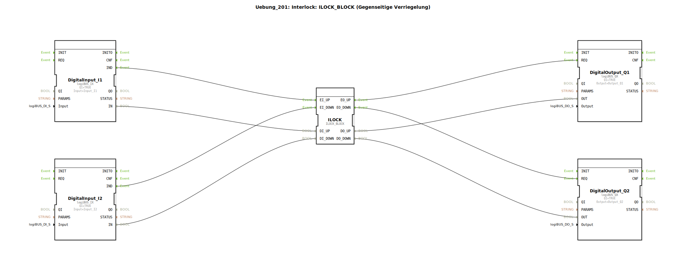

# Uebung_201: Interlock: ILOCK_BLOCK (Gegenseitige Verriegelung)

* * * * * * * * * *

## Einleitung

Diese Übung demonstriert die Realisierung einer **gegenseitigen Verriegelung** (Interlock) mittels des Funktionsbausteins `ILOCK_BLOCK`. Ziel ist es, zwei digitale Eingänge (`I1`, `I2`) so zu verknüpfen, dass immer nur einer der beiden zugehörigen Ausgänge (`Q1`, `Q2`) aktiv sein kann. Sobald ein Eingangssignal anliegt, wird der Ausgang gesetzt und der jeweils andere Ausgang gesperrt. Die Übung nutzt die Hardwarebausteine `logiBUS_IX` (Digitaleingang) und `logiBUS_QX` (Digitalausgang) sowie den Verriegelungsbaustein aus der `logiBUS`‑Bibliothek.

## Verwendete Funktionsbausteine (FBs)

### Sub-Bausteine: `DigitalInput_I1`
- **Typ**: `logiBUS::io::DI::logiBUS_IX`
- **Verwendete interne FBs**: Keine (Hardwaretreiber)
  - **Parameter**:
    - `QI` = `TRUE`
    - `Input` = `Input_I1`
  - **Ereignisausgang**: `IND` (wird bei Signaländerung ausgelöst)
  - **Datenausgang**: `IN` (aktueller digitaler Wert)

### Sub-Bausteine: `DigitalInput_I2`
- **Typ**: `logiBUS::io::DI::logiBUS_IX`
- **Verwendete interne FBs**: Keine
  - **Parameter**:
    - `QI` = `TRUE`
    - `Input` = `Input_I2`
  - **Ereignisausgang**: `IND`
  - **Datenausgang**: `IN`

### Sub-Bausteine: `ILOCK`
- **Typ**: `logiBUS::signalprocessing::interlock::ILOCK_BLOCK`
- **Verwendete interne FBs**: Keine (vordefinierter Verriegelungsblock)
  - **Parameter**: Keine
  - **Ereigniseingänge**:
    - `EI_UP` – Ereignis für Kanal 1 (z. B. Taste „Auf“)
    - `EI_DOWN` – Ereignis für Kanal 2 (z. B. Taste „Ab“)
  - **Ereignisausgänge**:
    - `EO_UP` – Freigabe für Kanal 1
    - `EO_DOWN` – Freigabe für Kanal 2
  - **Dateneingänge**:
    - `DI_UP` – digitaler Wert für Kanal 1
    - `DI_DOWN` – digitaler Wert für Kanal 2
  - **Datenausgänge**:
    - `DO_UP` – gesetzter Ausgangswert für Kanal 1
    - `DO_DOWN` – gesetzter Ausgangswert für Kanal 2
- **Funktionsweise**:  
  Der `ILOCK_BLOCK` wertet die beiden Kanäle aus. Wenn `DI_UP` aktiv (`1`) und das Ereignis `EI_UP` eintrifft, wird `DO_UP` auf `1` gesetzt und gleichzeitig `DO_DOWN` auf `0` zurückgesetzt (Verriegelung). Analog wird bei Aktivierung von Kanal 2 der Kanal 1 gesperrt. Es ist sichergestellt, dass nie beide Ausgänge gleichzeitig `TRUE` werden.

### Sub-Bausteine: `DigitalOutput_Q1`
- **Typ**: `logiBUS::io::DQ::logiBUS_QX`
- **Verwendete interne FBs**: Keine
  - **Parameter**:
    - `QI` = `TRUE`
    - `Output` = `Output_Q1`
  - **Ereigniseingang**: `REQ` (Auslösung zur Ausgabe)
  - **Dateneingang**: `OUT` (auszugebender Wert)

### Sub-Bausteine: `DigitalOutput_Q2`
- **Typ**: `logiBUS::io::DQ::logiBUS_QX`
- **Verwendete interne FBs**: Keine
  - **Parameter**:
    - `QI` = `TRUE`
    - `Output` = `Output_Q2`
  - **Ereigniseingang**: `REQ`
  - **Dateneingang**: `OUT`

## Programmablauf und Verbindungen

Der Ablauf der Übung wird durch die **Ereignis‑ und Datenverbindungen** im SubApp‑Netzwerk bestimmt:

1. **Eingangssignal‑Erfassung**  
   Die beiden Digitaleingänge `DigitalInput_I1` und `DigitalInput_I2` überwachen die physikalischen Eingänge `Input_I1` bzw. `Input_I2`. Bei einer steigenden oder fallenden Flanke wird das Ereignis `IND` ausgelöst.

2. **Ereignisweiterleitung zum ILOCK**  
   - `DigitalInput_I1.IND` → `ILOCK.EI_UP`  
   - `DigitalInput_I2.IND` → `ILOCK.EI_DOWN`  
   Gleichzeitig werden die aktuellen digitalen Werte über die Datenverbindungen an den `ILOCK` übergeben:  
   - `DigitalInput_I1.IN` → `ILOCK.DI_UP`  
   - `DigitalInput_I2.IN` → `ILOCK.DI_DOWN`

3. **Verriegelungslogik**  
   Der `ILOCK_BLOCK` verarbeitet die eingehenden Ereignisse und Daten. Er setzt den Ausgang `DO_UP` (bzw. `DO_DOWN`) auf den Wert des zugehörigen Eingangs, sofern der andere Kanal nicht bereits aktiv ist. Durch die interne Logik wird sichergestellt, dass immer nur ein Kanal den Wert `TRUE` liefern kann. Die Ausgangsereignisse `EO_UP` und `EO_DOWN` werden entsprechend generiert.

4. **Ausgabe an die Hardware**  
   Die Ereignisse und Daten des `ILOCK` werden an die Digitalausgänge weitergeleitet:  
   - `ILOCK.EO_UP` → `DigitalOutput_Q1.REQ`  
   - `ILOCK.EO_DOWN` → `DigitalOutput_Q2.REQ`  
   - `ILOCK.DO_UP` → `DigitalOutput_Q1.OUT`  
   - `ILOCK.DO_DOWN` → `DigitalOutput_Q2.OUT`  

   Der jeweilige Ausgangsbaustein übernimmt den Wert und gibt ihn an den physikalischen Ausgang `Output_Q1` bzw. `Output_Q2` aus.

**Zusammenfassende Funktionsweise**:  
Wird der erste Eingang aktiviert (z. B. Taste an `Input_I1`), so schaltet der zugehörige Ausgang `Output_Q1` ein und der zweite Ausgang wird sofort ausgeschaltet. Wird anschließend der zweite Eingang aktiviert, wechselt der aktive Ausgang zu `Output_Q2` und `Output_Q1` wird wieder ausgeschaltet. Ein gleichzeitiges Halten beider Eingänge führt zu einer definierten Priorisierung (üblicherweise der zuletzt gedrückte Kanal).

## Zusammenfassung

- **Ziel der Übung**: Grundlegendes Verständnis der gegenseitigen Verriegelung (Interlock) und deren Umsetzung mit dem vordefinierten Baustein `ILOCK_BLOCK`.
- **Schwierigkeitsgrad**: Einsteiger (Grundlagen der Ereignis‑ und Datenverarbeitung).
- **Vorkenntnisse**: Basiswissen über 4diac‑IDE, Funktionsbausteine und logiBUS‑Hardwaretreiber.
- **Lerninhalte**:
  - Umgang mit digitalen Ein‑/Ausgangsbausteinen (`logiBUS_IX`, `logiBUS_QX`).
  - Ereignisgesteuerte Verbindungen zwischen Funktionsbausteinen.
  - Anwendung eines spezialisierten Verriegelungsblocks (`ILOCK_BLOCK`).
  - Debugging und Testen in der 4diac‑IDE (z. B. durch Simulation mit Testtreibern).

Nach Abschluss dieser Übung sind Sie in der Lage, einfache Interlock‑Logiken in Steuerungsanwendungen zu integrieren und zu erweitern.